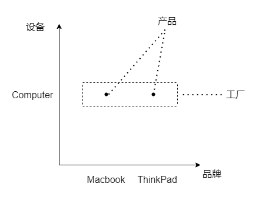
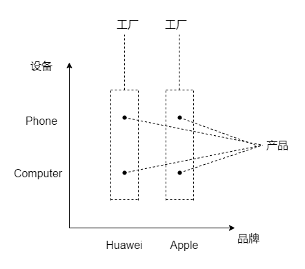

# 工厂模式与抽象工厂模式

[[toc]]

## 工厂模式

### 产品接口

~~~java
package com.learn.ssm.chapter2.reflect.factory;

public interface Computer {
    void start();
}
~~~

### 具体产品类

#### 产品1

~~~java
package com.learn.ssm.chapter2.reflect.factory;

public class Macbook implements Computer{

    @Override
    public void start() {
        System.out.println("Macbook starting...");
    }
}
~~~

#### 产品2

~~~java
package com.learn.ssm.chapter2.reflect.factory;

public class ThinkPad implements Computer{
    @Override
    public void start() {
        System.out.println("ThinkPad starting...");
    }
}
~~~

### 工厂类

~~~java
package com.learn.ssm.chapter2.reflect.factory;

public class ComputerFactory {
    public static Computer createComputer(String type) {
        if("Mac".equalsIgnoreCase(type)) {
            return new Macbook();
        } else if("ThinkPad".equalsIgnoreCase(type)) {
            return new ThinkPad();
        }
        return null;
    }
}
~~~

### 主程序

~~~java
package com.learn.ssm.chapter2.reflect.factory;

public class Main {
    public static void main(String[] args) {
        Computer computer = ComputerFactory.createComputer("Mac");
        computer.start();//Macbook starting...
    }
}
~~~

## 抽象工厂模式

### 产品接口

#### 设备1

~~~java
package com.learn.ssm.chapter2.reflect.factory;

public interface Phone {
    void call();
}
~~~

#### 设备2

~~~java
package com.learn.ssm.chapter2.reflect.factory;

public interface Computer {
    void start();
}
~~~

### 具体产品类

#### 品牌1设备1

~~~java
package com.learn.ssm.chapter2.reflect.factory;

public class HuaweiPhone implements Phone{
    @Override
    public void call() {
        System.out.println("Huawei calling...");
    }
}
~~~

#### 品牌1设备2

~~~java
package com.learn.ssm.chapter2.reflect.factory;

public class HuaweiComputer implements Computer{
    @Override
    public void start() {
        System.out.println("Huawei starting...");
    }
}
~~~

#### 品牌2设备1

~~~java
package com.learn.ssm.chapter2.reflect.factory;

public class ApplePhone implements Phone{
    @Override
    public void call() {
        System.out.println("Apple calling...");
    }
}
~~~

#### 品牌2设备2

~~~java
package com.learn.ssm.chapter2.reflect.factory;

public class AppleComputer implements Computer{
    @Override
    public void start() {
        System.out.println("Apple starting...");
    }
}
~~~

### 工厂接口

~~~java
package com.learn.ssm.chapter2.reflect.factory;

public interface ProductFactory {
    Phone createPhone();
    Computer createComputer();
}
~~~

### 具体工厂类

#### 品牌1工厂

~~~java
package com.learn.ssm.chapter2.reflect.factory;

public class HuaweiFactory implements ProductFactory{
    @Override
    public Phone createPhone() {
        return new HuaweiPhone();
    }

    @Override
    public Computer createComputer() {
        return new HuaweiComputer();
    }
}
~~~

#### 品牌2工厂

~~~java
package com.learn.ssm.chapter2.reflect.factory;

public class AppleFactory implements ProductFactory{
    @Override
    public Phone createPhone() {
        return new ApplePhone();
    }

    @Override
    public Computer createComputer() {
        return new AppleComputer();
    }
}
~~~

### 主程序

~~~java
package com.learn.ssm.chapter2.reflect.factory;

public class Main {
    public static void main(String[] args) {
        ProductFactory factory = new HuaweiFactory();
        Phone phone = factory.createPhone();
        phone.call();//Huawei calling...

        Computer computer1 = factory.createComputer();
        computer1.start();//Huawei starting...
    }
}
~~~

## 总结

好的，我用最直白的大白话给你解释！

### 工厂模式

> 就像你去奶茶店点单

**没有工厂模式的情况：**

- 你想喝奶茶，得自己：
  1. 去找茶叶
  2. 去找牛奶
  3. 去找糖
  4. 自己调配比例
  5. 自己煮
- **太麻烦了，而且如果你不懂配方，根本做不出来**

**有工厂模式的情况：**

- 你直接去奶茶店：
  - 说"我要一杯珍珠奶茶"
  - 店员给你做好的奶茶
- **你不用关心怎么做，只要说要什么就行了**

**工厂模式的意义：**

> **你不用知道对象是怎么创建的，只要告诉工厂"我要什么"，工厂就给你造出来**

---

### 抽象工厂模式

> 就像你买整套家电

**场景：你要装修新房，买一整套家电**

**没有抽象工厂模式：**

- 你去国美买海尔冰箱
- 去苏宁买格力空调
- 去京东买小米电视
- 去实体店买美的洗衣机
- **结果：每个家电操作方式不同，遥控器一堆，风格也不统一**

**有抽象工厂模式：**
- **方案A**：全部买小米智能家居
  - 小米冰箱 + 小米空调 + 小米电视 + 小米洗衣机
  - 全部可以用小爱同学控制，风格统一
  
- **方案B**：全部买海尔智能家居  
  - 海尔冰箱 + 海尔空调 + 海尔电视 + 海尔洗衣机
  - 全部可以用海尔APP控制

**抽象工厂模式的意义：**
> **保证你得到的一整套产品都是相互兼容、风格一致的，不会出现"小米遥控器控制不了海尔空调"的问题**

总结一下，就是单个产品 vs 成套产品的区别。

