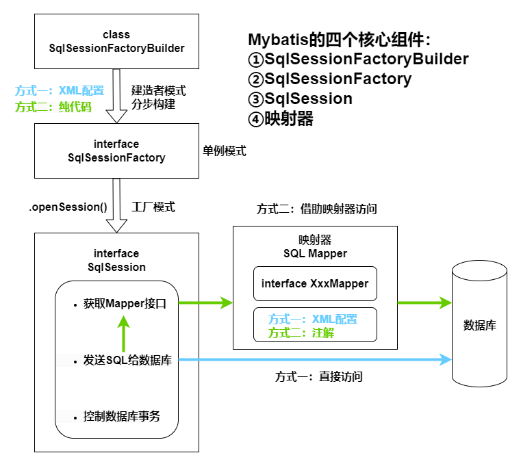
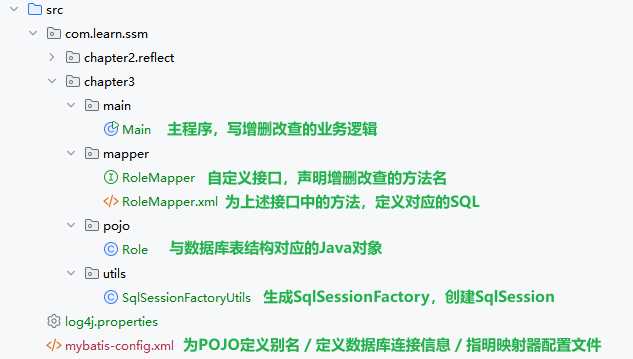

# Mybatis 核心组件

[[toc]]

## 核心组件

1. SqlSessionFactoryBuilder：根据XML配置或者纯代码的方式来生成SqlSessionFactory，采用**建造者模式**来分步构建，生成的SqlSessionFactory是**单例模式**。
2. SqlSessionFactory：采用**工厂模式**通过openSession方法生成SqlSession。
3. SqlSession：
   * 获取Mapper接口
   * 发送SQL给数据库
   * 控制数据库事务
4. SQL Mapper（映射器）：由一个自定义Mapper接口 + XML或注解两部分构成。前者声明方法，后者给出方法对应的SQL。

> 映射器里的Mapper只是个接口，而非实现类，接口不是不能运行吗？那Mapper接口是如何发挥作用的？
>
> **MyBatis 利用了 JDK 的动态代理机制，为每个 Mapper 接口生成了一个代理对象，方法调用时会自动执行与之绑定的 SQL。**

## 生命周期

| 对象                     | 生命周期     | 线程安全 | 使用建议                         |
| ------------------------ | ------------ | -------- | -------------------------------- |
| SqlSessionFactoryBuilder | 很短         | ❌        | 用一次就丢，不要共享             |
| SqlSessionFactory        | 很长（单例） | ✅        | 应用中唯一实例，全局共享         |
| SqlSession               | 很短         | ❌        | 每次数据库操作创建一个，用完关闭 |
| Mapper                   | 很短         | ❌        | 每次从 SqlSession 获取，不跨线程 |

> 如果是在 Spring 项目中，这些对象的生命周期和管理会由 Spring 接管，`SqlSession` 可以由 Spring 自动注入并管理事务。

## 实例

### 1.准备jar包

* mybatis-3.4.1.jar
* mysql-connector-j-8.0.33.jar
* log4j-1.2.17.jar

### 2.文件结构

**POJO**

~~~java
package com.learn.ssm.chapter3.pojo;

public class Role {
    private Long id;
    private String roleName;
    private String note;

    //如果你没有写任何构造函数，Java 会自动生成一个无参构造函数。
    //public Role(){}

    public Long getId() {
        return id;
    }

    public void setId(Long id) {
        this.id = id;
    }

    public String getRoleName() {
        return roleName;
    }

    public void setRoleName(String roleName) {
        this.roleName = roleName;
    }

    public String getNote() {
        return note;
    }

    public void setNote(String note) {
        this.note = note;
    }
}
~~~

**映射器Mapper接口**

~~~java
package com.learn.ssm.chapter3.mapper;

import com.learn.ssm.chapter3.pojo.Role;
import java.util.List;

public interface RoleMapper {
    public int insertRole(Role role);
    public int deleteRole(Long id);
    public int updateRole(Role role);
    public Role getRole(Long id);
    public List<Role> findRoles(String roleName);
}
~~~

**映射器配置（XML）**

~~~xml
<?xml version="1.0" encoding="UTF-8" ?>
<!DOCTYPE mapper PUBLIC "-//mybatis.org//DTD Mapper 3.0//EN"
        "http://mybatis.org/dtd/mybatis-3-mapper.dtd">
<mapper namespace="com.learn.ssm.chapter3.mapper.RoleMapper">

    <insert id="insertRole" parameterType="role">
        insert into t_role(id, role_name, note) 
        values(#{id}, #{roleName}, #{note})
    </insert>

    <delete id="deleteRole" parameterType="long">
        delete from t_role where id = #{id}
    </delete>

    <update id="updateRole" parameterType="role">
        update t_role set role_name = #{roleName}, note = #{note} 
        where id = #{id}
    </update>

    <select id="getRole" parameterType="long" resultType="role">
        select id, role_name as roleName, note from t_role where id = #{id}
    </select>

    <select id="findRoles" parameterType="string" resultType="role">
        select id, role_name as roleName, note from t_role
        where role_name like concat('%', #{roleName}, '%')
    </select>

</mapper>
~~~

**mybatis-config.xml**

~~~xml
<?xml version="1.0" encoding="UTF-8" ?>
<!DOCTYPE configuration   PUBLIC "-//mybatis.org//DTD Config 3.0//EN"
        "http://mybatis.org/dtd/mybatis-3-config.dtd">
<configuration>
    <typeAliases><!-- 别名 -->
        <typeAlias alias="role" type="com.learn.ssm.chapter3.pojo.Role"/>
    </typeAliases>
    <!-- 数据库环境 -->
    <environments default="development">
        <environment id="development">
            <transactionManager type="JDBC"/>
            <dataSource type="POOLED">
                <property name="driver" value="com.mysql.cj.jdbc.Driver"/>
                <property name="url" value="jdbc:mysql://localhost:3306/ssm"/>
                <property name="username" value="root"/>
                <property name="password" value="123456"/>
            </dataSource>
        </environment>
    </environments>
    <!-- 映射文件 -->
    <mappers>
        <mapper resource="com/learn/ssm/chapter3/mapper/RoleMapper.xml"/>
    </mappers>
</configuration>
~~~

构建SqlSessionFactory与SqlSession

~~~java
package com.learn.ssm.chapter3.utils;

import org.apache.ibatis.io.Resources;
import org.apache.ibatis.session.SqlSession;
import org.apache.ibatis.session.SqlSessionFactory;
import org.apache.ibatis.session.SqlSessionFactoryBuilder;

import java.io.IOException;
import java.io.InputStream;

public class SqlSessionFactoryUtils {

    private final static Class<SqlSessionFactoryUtils> LOCK = SqlSessionFactoryUtils.class;

    // 构造函数
    private SqlSessionFactoryUtils(){}

    // 单例模式
    private static SqlSessionFactory sqlSessionFactory = null;
    public static SqlSessionFactory getSqlSessionFactory() {
        synchronized (LOCK) {
            if(sqlSessionFactory != null) {
                return sqlSessionFactory;
            }

            // XML配置方式 实例化SqlSessionFactory
            String resource = "mybatis-config.xml";
            InputStream inputStream;
            try {
                inputStream = Resources.getResourceAsStream(resource);
                sqlSessionFactory = new SqlSessionFactoryBuilder().build(inputStream);
            } catch (IOException e) {
                e.printStackTrace();
            }
        }
        return sqlSessionFactory;
    }

    public static SqlSession openSqlSession() {
        if(sqlSessionFactory == null) {
            getSqlSessionFactory();
        }
        return sqlSessionFactory.openSession();
    }

}
~~~

**主程序**

~~~java
package com.learn.ssm.chapter3.main;

import com.learn.ssm.chapter3.mapper.RoleMapper;
import com.learn.ssm.chapter3.pojo.Role;
import com.learn.ssm.chapter3.utils.SqlSessionFactoryUtils;
import org.apache.ibatis.session.SqlSession;
import org.apache.log4j.Logger;
import java.util.List;

public class Main {
    public static void main(String[] args) {
        testRoleMapper();
    }

    private static void testRoleMapper() {
        Logger logger = Logger.getLogger(Main.class);
        SqlSession sqlSession = null;
        try {
            sqlSession = SqlSessionFactoryUtils.openSqlSession();
            RoleMapper roleMapper = sqlSession.getMapper(RoleMapper.class);

            Role role = new Role();
            role.setId(1L);
            role.setRoleName("Admin");
            role.setNote("System role");
            int num = roleMapper.insertRole(role);
            logger.info(num);//1

            Role role1 = roleMapper.getRole(1L);
            logger.info(role1);//com.learn.ssm.chapter3.pojo.Role@551a20d6

            role1.setRoleName("Administrator");
            num = roleMapper.updateRole(role1);
            logger.info(num);//1

            Role role2 = new Role();
            role2.setId(2L);
            role2.setRoleName("Visitor");
            role2.setNote("Unregistered");
            num = roleMapper.insertRole(role2);
            logger.info(num);//1

            List<Role> roles = roleMapper.findRoles("i");
            logger.info(roles);
            // [com.learn.ssm.chapter3.pojo.Role@7a11c4c7, com.learn.ssm.chapter3.pojo.Role@4cc547a]

            //提交事务
            sqlSession.commit();
        } catch (Exception e) {
            if(sqlSession != null) {
                sqlSession.rollback();
            }
            e.printStackTrace();
        } finally {
            if (sqlSession != null) {
                sqlSession.close();
            }
        }
    }
}
~~~

### 3.输出

~~~shell
DEBUG 2025-04-23 11:13:00,807 org.apache.ibatis.logging.LogFactory: Logging initialized using 'class org.apache.ibatis.logging.log4j.Log4jImpl' adapter.
DEBUG 2025-04-23 11:13:00,903 org.apache.ibatis.datasource.pooled.PooledDataSource: PooledDataSource forcefully closed/removed all connections.
DEBUG 2025-04-23 11:13:00,903 org.apache.ibatis.datasource.pooled.PooledDataSource: PooledDataSource forcefully closed/removed all connections.
DEBUG 2025-04-23 11:13:00,903 org.apache.ibatis.datasource.pooled.PooledDataSource: PooledDataSource forcefully closed/removed all connections.
DEBUG 2025-04-23 11:13:00,903 org.apache.ibatis.datasource.pooled.PooledDataSource: PooledDataSource forcefully closed/removed all connections.
DEBUG 2025-04-23 11:13:00,962 org.apache.ibatis.transaction.jdbc.JdbcTransaction: Opening JDBC Connection
DEBUG 2025-04-23 11:13:01,557 org.apache.ibatis.datasource.pooled.PooledDataSource: Created connection 50503805.
DEBUG 2025-04-23 11:13:01,557 org.apache.ibatis.transaction.jdbc.JdbcTransaction: Setting autocommit to false on JDBC Connection [com.mysql.cj.jdbc.ConnectionImpl@302a07d]
DEBUG 2025-04-23 11:13:01,559 org.apache.ibatis.logging.jdbc.BaseJdbcLogger: ==>  Preparing: insert into t_role(id, role_name, note) values(?, ?, ?) 
DEBUG 2025-04-23 11:13:01,581 org.apache.ibatis.logging.jdbc.BaseJdbcLogger: ==> Parameters: 1(Long), Admin(String), System role(String)
DEBUG 2025-04-23 11:13:01,584 org.apache.ibatis.logging.jdbc.BaseJdbcLogger: <==    Updates: 1
 INFO 2025-04-23 11:13:01,584 com.learn.ssm.chapter3.main.Main: 1
DEBUG 2025-04-23 11:13:01,585 org.apache.ibatis.logging.jdbc.BaseJdbcLogger: ==>  Preparing: select id, role_name as roleName, note from t_role where id = ? 
DEBUG 2025-04-23 11:13:01,586 org.apache.ibatis.logging.jdbc.BaseJdbcLogger: ==> Parameters: 1(Long)
DEBUG 2025-04-23 11:13:01,601 org.apache.ibatis.logging.jdbc.BaseJdbcLogger: <==      Total: 1
 INFO 2025-04-23 11:13:01,602 com.learn.ssm.chapter3.main.Main: com.learn.ssm.chapter3.pojo.Role@5644dc81
DEBUG 2025-04-23 11:13:01,602 org.apache.ibatis.logging.jdbc.BaseJdbcLogger: ==>  Preparing: update t_role set role_name = ?, note = ? where id = ? 
DEBUG 2025-04-23 11:13:01,603 org.apache.ibatis.logging.jdbc.BaseJdbcLogger: ==> Parameters: Administrator(String), System role(String), 1(Long)
DEBUG 2025-04-23 11:13:01,604 org.apache.ibatis.logging.jdbc.BaseJdbcLogger: <==    Updates: 1
 INFO 2025-04-23 11:13:01,604 com.learn.ssm.chapter3.main.Main: 1
DEBUG 2025-04-23 11:13:01,604 org.apache.ibatis.logging.jdbc.BaseJdbcLogger: ==>  Preparing: insert into t_role(id, role_name, note) values(?, ?, ?) 
DEBUG 2025-04-23 11:13:01,604 org.apache.ibatis.logging.jdbc.BaseJdbcLogger: ==> Parameters: 2(Long), Visitor(String), Unregistered(String)
DEBUG 2025-04-23 11:13:01,605 org.apache.ibatis.logging.jdbc.BaseJdbcLogger: <==    Updates: 1
 INFO 2025-04-23 11:13:01,605 com.learn.ssm.chapter3.main.Main: 1
DEBUG 2025-04-23 11:13:01,605 org.apache.ibatis.logging.jdbc.BaseJdbcLogger: ==>  Preparing: select id, role_name as roleName, note from t_role where role_name like concat('%', ?, '%') 
DEBUG 2025-04-23 11:13:01,605 org.apache.ibatis.logging.jdbc.BaseJdbcLogger: ==> Parameters: i(String)
DEBUG 2025-04-23 11:13:01,607 org.apache.ibatis.logging.jdbc.BaseJdbcLogger: <==      Total: 2
 INFO 2025-04-23 11:13:01,607 com.learn.ssm.chapter3.main.Main: [com.learn.ssm.chapter3.pojo.Role@3381b4fc, com.learn.ssm.chapter3.pojo.Role@6bea52d4]
DEBUG 2025-04-23 11:13:01,607 org.apache.ibatis.transaction.jdbc.JdbcTransaction: Committing JDBC Connection [com.mysql.cj.jdbc.ConnectionImpl@302a07d]
DEBUG 2025-04-23 11:13:01,693 org.apache.ibatis.transaction.jdbc.JdbcTransaction: Resetting autocommit to true on JDBC Connection [com.mysql.cj.jdbc.ConnectionImpl@302a07d]
DEBUG 2025-04-23 11:13:01,693 org.apache.ibatis.transaction.jdbc.JdbcTransaction: Closing JDBC Connection [com.mysql.cj.jdbc.ConnectionImpl@302a07d]
DEBUG 2025-04-23 11:13:01,693 org.apache.ibatis.datasource.pooled.PooledDataSource: Returned connection 50503805 to pool.
~~~

## 其他补充

### 纯代码创建SqlSessionFactory

~~~java
public static SqlSessionFactory getSqlSessionFactory2() {
  synchronized (LOCK) {
    // 数据库连接池信息
    PooledDataSource dataSource = new PooledDataSource();
    dataSource.setDriver("com.mysql.jdbc.Driver");
    dataSource.setUsername("root");
    dataSource.setPassword("123456");
    dataSource.setUrl("jdbc:mysql://localhost:3306/chapter3");
    dataSource.setDefaultAutoCommit(false);
    // 采用MyBatis的JDBC事务方式
    TransactionFactory transactionFactory = new JdbcTransactionFactory();
    Environment environment = new Environment("development", transactionFactory, dataSource);
    // 创建Configuration对象
    Configuration configuration = new Configuration(environment);
    // 注册一个MyBatis上下文别名
    configuration.getTypeAliasRegistry().registerAlias("role", Role.class);
    // 加入一个映射器
    configuration.addMapper(RoleMapper.class);
    configuration.addMapper(RoleMapper2.class);
    // 使用SqlSessionFactoryBuilder构建SqlSessionFactory
    sqlSessionFactory = new SqlSessionFactoryBuilder().build(configuration);
    return sqlSessionFactory;
  }
}
~~~

> 代码冗长，如果发生系统修改，那么有可能需要重新编译代码才能继续。

### Mapper+注解实现映射器

~~~java
package com.learn.ssm.chapter3.mapper;

import org.apache.ibatis.annotations.Select;

import com.learn.ssm.chapter3.pojo.Role;

public interface RoleMapper2 {
	
	@Select("select id, role_name as roleName, note from t_role where id=#{id}")
	public Role getRole(Long id);
}
~~~

> 效果等同于Mapper+XML实现映射器，如果两种方式都用了，那么XML方式会覆盖掉注解方式，即XML方式优先级更高。
>
> 在实际业务中，SQL的复杂度很高，采用注解方式会将大量的SQL放入Java代码中，代码可读性会下降，如果再涉及动态SQL，注解就更复杂了，不利于后期维护和修改。
>
> 此外，XML可以相互引入，但注解不行。所以XML方式用的较多。

### SqlSession直接发送SQL

~~~java
Role role = (Role)sqlSession.
selectOne("com.learn.ssm.chapter3.mapper.RoleMapper.getRole", 1L); 
~~~

&ensp;&ensp;&ensp;&ensp;selectOne 方法表示使用查询并且只返回一个对象，而参数则是一个String对象和一个Object对象。这里是一个long 参数，long 参数是它的主键。

&ensp;&ensp;&ensp;&ensp;String 对象是由一个命名空间加上 SQL id 组合而成的，它完全定位了一条SQL，这样 MyBatis 就会找到对应的SQL 。如果在 MyBatis 中只有一个 id为getRole的SQL，那么上述代码可以简写为：

~~~java
Role role = (Role)sqlSession.selectOne("getRole", 1L);
~~~

&ensp;&ensp;&ensp;&ensp;这是Mybatis的前身iBatis所留下的方式。现在通常都是先获取Mapper接口，由Mapper发送SQL。

