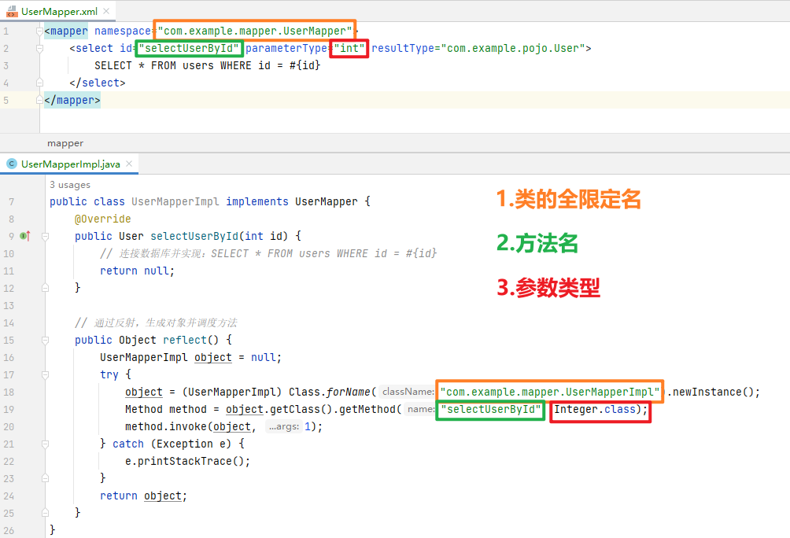

# Mybatis 的反射

[[toc]]

## 涉及文件

### UserMapper

~~~java
package com.example.mapper;

import com.example.pojo.User;

public interface UserMapper {
    User selectUserById(int id);
}
~~~

### UserMapper.xml

~~~xml
<mapper namespace="com.example.mapper.UserMapper">
    <select id="selectUserById" parameterType="int" resultType="com.example.pojo.User">
        SELECT * FROM users WHERE id = #{id}
    </select>
</mapper>
~~~

### UserMapperImpl

~~~java
package com.example.mapper;

import com.example.pojo.User;

import java.lang.reflect.Method;

public class UserMapperImpl implements UserMapper {
    @Override
    public User selectUserById(int id) {
        // 连接数据库并实现：SELECT * FROM users WHERE id = #{id}
        return null;
    }

    // 通过反射，生成对象并调度方法
    public Object reflect() {
        UserMapperImpl object = null;
        try {
            object = (UserMapperImpl) Class.forName("com.example.mapper.UserMapperImpl").newInstance();
            Method method = object.getClass().getMethod("selectUserById", Integer.class);
            method.invoke(object, 1);
        } catch (Exception e) {
            e.printStackTrace();
        }
        return object;
    }
}
~~~

## Mybatis vs 原始反射

> 由此可见，MyBatis的底层是基于**反射**实现的**动态代理**。