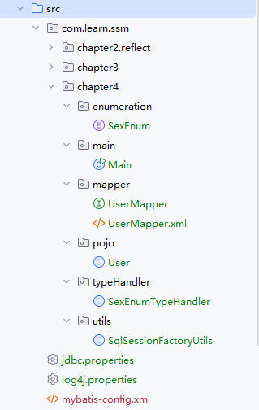

# Mybatis配置

[[toc]]

## 概述

~~~xml
<?xml version="1.0" encoding="UTF-8" ?>
<configuration>
    <properties/> <!-- 属性 -->
    <settings/><!-- 设置 -->
    <typeAliases/><!-- 别名 -->
	<typeHandlers/><!-- 类型转换 -->
    <objectFactory/><!-- 对象工厂 -->
	<plugins/><!--插件-->
    
    <environments default="development"><!-- 数据库环境 -->
        <environment id="development"><!-- 环境XX -->
            <transactionManager type="JDBC"/><!-- 事务管理器 -->
            <dataSource type="POOLED"/><!-- 数据源 -->
        </environment>
    </environments>
    
    <databaseIdProvider/><!-- 数据库厂商标识 -->
    <mappers/><!-- 映射器 -->
</configuration>
~~~

&ensp;&ensp;&ensp;&ensp;MyBatis 配置项的顺序不能颠倒。如果颠倒了它们的顺序，那么 MyBatis 启动阶段就会发生异常导致程序无法运行。

## 1.properties

properties属性可以给系统配置一些**运行参数**。有三种方式使用它：

* property 子元素
* properties 文件（推荐）
* 程序代码传递

它们的优先级是：程序代码传递 > properties文件 > property 子元素，推荐使用properties文件。


最初数据库配置方式如下：

~~~xml
<environments default="development">
    <environment id="development">
        <transactionManager type="JDBC"/>
        <dataSource type="POOLED">
            <property name="driver" value="com.mysql.cj.jdbc.Driver"/>
            <property name="url" value="jdbc:mysql://localhost:3306/ssm"/>
            <property name="username" value="root"/>
            <property name="password" value="123456"/>
        </dataSource>
    </environment>
</environments>
~~~

默认是固定写死的，可以用下面三种方式将其提取出来。


### property 子元素

~~~xml
<?xml version="1.0" encoding="UTF-8" ?>
<!DOCTYPE configuration   PUBLIC "-//mybatis.org//DTD Config 3.0//EN"
        "http://mybatis.org/dtd/mybatis-3-config.dtd">
<configuration>
    
    <properties>
        <property name="database.driver" value="com.mysql.cj.jdbc.Driver"/>
        <property name="database.url" value="jdbc:mysql://localhost:3306/ssm"/>
        <property name="database.username" value="root"/>
        <property name="database.password" value="123456"/>
    </properties>

    <environments default="development">
        <environment id="development">
            <transactionManager type="JDBC"/>
            <dataSource type="POOLED">
                <property name="driver" value="${database.driver}"/>
                <property name="url" value="${database.url}"/>
                <property name="username" value="${database.username}"/>
                <property name="password" value="${database.password}"/>
            </dataSource>
        </environment>
    </environments>
</configuration>
~~~

如果属性参数有成百上千个，这种写法不合适，推荐properties文件。


### properties 文件

jdbc.properties

~~~properties
database.driver=com.mysql.cj.jdbc.Driver
database.url=jdbc:mysql://localhost:3306/ssm
database.username=root
database.password=123456
~~~

~~~xml
<?xml version="1.0" encoding="UTF-8" ?>
<!DOCTYPE configuration   PUBLIC "-//mybatis.org//DTD Config 3.0//EN"
        "http://mybatis.org/dtd/mybatis-3-config.dtd">
<configuration>

    <properties resource="jdbc.properties"/>

    <environments default="development">
        <environment id="development">
            <transactionManager type="JDBC"/>
            <dataSource type="POOLED">
                <property name="driver" value="${database.driver}"/>
                <property name="url" value="${database.url}"/>
                <property name="username" value="${database.username}"/>
                <property name="password" value="${database.password}"/>
            </dataSource>
        </environment>
    </environments>

</configuration>
~~~


### 程序代码传递

这里jdbc.properties文件里，连接数据库的用户名与密码是经过**运维人员**加密过的，对**开发人员**保密。那么需要将其解密后重新设置属性值。

~~~java
InputStream in = Resources.getResourceAsStream("jdbc.properties");
Properties props = new Properties();
props.load(in);
String username = props.getProperty("database.username");
String password = props.getProperty("database.password");
// 解密用户和密码，并在属性中重置
props.put("database.username", CodeUtils.decode(username));
props.put("database.password", CodeUtils.decode(password));
inputStream = Resources.getResourceAsStream(resource);
// 使用程序传递的方式覆盖原有的properties属性参数
sqlSessionFactory = new SqlSessionFactoryBuilder().build(inputStream, props);
~~~

因其优先级最高，所以会覆盖jdbc.properties里设置的默认值。


## 2.settings

&ensp;&ensp;&ensp;&ensp;settings 是 MyBatis 最复杂的配置，它能深刻影响 MyBatis 底层的运行，但是在大部分情况下使用默认值便可以运行。有时候需要修改一 些常用的规则，比如自动映射、驼峰命名映射、级联规则、 是否启动缓存、执行器（Executor）类型等。

常用配置项如下表所示：

| 配置项                             | 默认值    | 可选值 / 类型                                                | 作用说明                                                     |
| ---------------------------------- | --------- | ------------------------------------------------------------ | ------------------------------------------------------------ |
| `cacheEnabled`                     | `true`    | `true` / `false`                                             | 全局开启或关闭缓存（包括一级、二级缓存）                     |
| `lazyLoadingEnabled`               | `false`   | `true` / `false`                                             | 是否启用懒加载（延迟加载）                                   |
| `multipleResultSetsEnabled`        | `true`    | `true` / `false`                                             | 允许返回多个结果集（适用于存储过程）                         |
| `useColumnLabel`                   | `true`    | `true` / `false`                                             | 是否使用列标签而不是列名作为字段映射的依据（一般用 `AS` 时需要为 `true`） |
| `useGeneratedKeys`                 | `false`   | `true` / `false`                                             | 是否允许 JDBC 支持自动生成主键（例如 MySQL 的自增主键）      |
| `autoMappingBehavior`              | `PARTIAL` | `NONE` / `PARTIAL` / `FULL`                                  | 自动映射未知列到字段的行为（FULL 会更激进，NONE 禁用自动映射） |
| `autoMappingUnknownColumnBehavior` | `NONE`    | `NONE` / `WARNING` / `FAILING`                               | 未知列映射行为（NONE 忽略，WARNING 打日志，FAILING 抛异常）  |
| `defaultExecutorType`              | `SIMPLE`  | `SIMPLE` / `REUSE` / `BATCH`                                 | 设置默认执行器类型，`BATCH` 用于批量操作                     |
| `mapUnderscoreToCamelCase`         | `false`   | `true` / `false`                                             | 是否自动将下划线命名映射为驼峰命名（如 `user_name` -> `userName`） |
| `localCacheScope`                  | `SESSION` | `SESSION` / `STATEMENT`                                      | 本地缓存作用域（`SESSION` 共享一个会话缓存，`STATEMENT` 每次查询都清空） |
| `jdbcTypeForNull`                  | `OTHER`   | JDBC 类型                                                    | 为 null 值指定默认 JDBC 类型（如 `VARCHAR`, `NULL`, `OTHER`） |
| `logImpl`                          | 未配置    | `STDOUT_LOGGING`, `LOG4J`, `LOG4J2`, `SLF4J`, `COMMONS_LOGGING`, `NO_LOGGING` | 指定使用的日志框架                                           |
| `callSettersOnNulls`               | `false`   | `true` / `false`                                             | 为 null 值也调用 setter 方法（默认不调用）                   |
| `returnInstanceForEmptyRow`        | `false`   | `true` / `false`                                             | 查询结果为空时是否返回空对象而不是 null（影响结果映射）      |
| `shrinkWhitespacesInSql`           | `false`   | `true` / `false`                                             | 是否压缩 SQL 中多余的空白字符（保持格式统一）                |

## 3.typeAliases

&ensp;&ensp;&ensp;&ensp;由于类的全限定名称很长，需要大量使用的时候，总写那么长的名称不方便。在 MyBatis 中允许定义一个简写来代表这个类，这就是别名，别名分为系统定义别名和自定义别名。

&ensp;&ensp;&ensp;&ensp;MyBatis 中别名不区分大小写。

### 系统已定义

| 别名         | 对应 Java 类型         | 是否支持数组 |
| ------------ | ---------------------- | ------------ |
| `_byte`      | `byte`                 | ✅            |
| `_char`      | `char`                 | ✅            |
| `_double`    | `double`               | ✅            |
| `_float`     | `float`                | ✅            |
| `_int`       | `int`                  | ✅            |
| `_long`      | `long`                 | ✅            |
| `_short`     | `short`                | ✅            |
| `_boolean`   | `boolean`              | ✅            |
| `string`     | `java.lang.String`     | ✅            |
| `byte`       | `java.lang.Byte`       | ✅            |
| `char`       | `java.lang.Character`  | ✅            |
| `double`     | `java.lang.Double`     | ✅            |
| `float`      | `java.lang.Float`      | ✅            |
| `int`        | `java.lang.Integer`    | ✅            |
| `long`       | `java.lang.Long`       | ✅            |
| `short`      | `java.lang.Short`      | ✅            |
| `boolean`    | `java.lang.Boolean`    | ✅            |
| `date`       | `java.util.Date`       | ✅            |
| `decimal`    | `java.math.BigDecimal` | ✅            |
| `biginteger` | `java.math.BigInteger` | ✅            |
| `object`     | `java.lang.Object`     | ✅            |
| `map`        | `java.util.Map`        | ❌            |
| `hashmap`    | `java.util.HashMap`    | ❌            |
| `list`       | `java.util.List`       | ❌            |
| `arraylist`  | `java.util.ArrayList`  | ❌            |
| `collection` | `java.util.Collection` | ❌            |
| `iterator`   | `java.util.Iterator`   | ❌            |

上述别名是在`org.apache.ibatis.type.TypeAliasRegistry`类中定义的，如下代码所示：

~~~java
package org.apache.ibatis.type;

//import

public class TypeAliasRegistry {
    private final Map<String, Class<?>> TYPE_ALIASES = new HashMap();

    public TypeAliasRegistry() {
        this.registerAlias("string", String.class);
        this.registerAlias("byte", Byte.class);
        this.registerAlias("long", Long.class);
        this.registerAlias("short", Short.class);
        this.registerAlias("int", Integer.class);
        this.registerAlias("integer", Integer.class);
        this.registerAlias("double", Double.class);
        this.registerAlias("float", Float.class);
        this.registerAlias("boolean", Boolean.class);
        this.registerAlias("byte[]", Byte[].class);
        this.registerAlias("long[]", Long[].class);
        this.registerAlias("short[]", Short[].class);
        this.registerAlias("int[]", Integer[].class);
        this.registerAlias("integer[]", Integer[].class);
        this.registerAlias("double[]", Double[].class);
        this.registerAlias("float[]", Float[].class);
        this.registerAlias("boolean[]", Boolean[].class);
        this.registerAlias("_byte", Byte.TYPE);
        this.registerAlias("_long", Long.TYPE);
        this.registerAlias("_short", Short.TYPE);
        this.registerAlias("_int", Integer.TYPE);
        this.registerAlias("_integer", Integer.TYPE);
        this.registerAlias("_double", Double.TYPE);
        this.registerAlias("_float", Float.TYPE);
        this.registerAlias("_boolean", Boolean.TYPE);
        this.registerAlias("_byte[]", byte[].class);
        this.registerAlias("_long[]", long[].class);
        this.registerAlias("_short[]", short[].class);
        this.registerAlias("_int[]", int[].class);
        this.registerAlias("_integer[]", int[].class);
        this.registerAlias("_double[]", double[].class);
        this.registerAlias("_float[]", float[].class);
        this.registerAlias("_boolean[]", boolean[].class);
        this.registerAlias("date", Date.class);
        this.registerAlias("decimal", BigDecimal.class);
        this.registerAlias("bigdecimal", BigDecimal.class);
        this.registerAlias("biginteger", BigInteger.class);
        this.registerAlias("object", Object.class);
        this.registerAlias("date[]", Date[].class);
        this.registerAlias("decimal[]", BigDecimal[].class);
        this.registerAlias("bigdecimal[]", BigDecimal[].class);
        this.registerAlias("biginteger[]", BigInteger[].class);
        this.registerAlias("object[]", Object[].class);
        this.registerAlias("map", Map.class);
        this.registerAlias("hashmap", HashMap.class);
        this.registerAlias("list", List.class);
        this.registerAlias("arraylist", ArrayList.class);
        this.registerAlias("collection", Collection.class);
        this.registerAlias("iterator", Iterator.class);
        this.registerAlias("ResultSet", ResultSet.class);
    }

    public <T> Class<T> resolveAlias(String string) {
        //...
    }

    public void registerAliases(String packageName) {
        this.registerAliases(packageName, Object.class);
    }

    public void registerAliases(String packageName, Class<?> superType) {
        //...
    }

    public void registerAlias(Class<?> type) {
        //...
    }

    public void registerAlias(String alias, Class<?> value) {
        //...
    }

    public void registerAlias(String alias, String value) {
        //...
    }

    public Map<String, Class<?>> getTypeAliases() {
        return Collections.unmodifiableMap(this.TYPE_ALIASES);
    }
}
~~~

而`org.apache.ibatis.session.Configuration`类中也对一些常用配置项配置了别名，如下代码所示：

~~~java
package org.apache.ibatis.session;

//import

public class Configuration {
    //variables...

    public Configuration(Environment environment) {
        this();
        this.environment = environment;
    }

    public Configuration() {
        //initial...
        
        this.typeAliasRegistry.registerAlias("JDBC", JdbcTransactionFactory.class);
        this.typeAliasRegistry.registerAlias("MANAGED", ManagedTransactionFactory.class);
        this.typeAliasRegistry.registerAlias("JNDI", JndiDataSourceFactory.class);
        this.typeAliasRegistry.registerAlias("POOLED", PooledDataSourceFactory.class);
        this.typeAliasRegistry.registerAlias("UNPOOLED", UnpooledDataSourceFactory.class);
        this.typeAliasRegistry.registerAlias("PERPETUAL", PerpetualCache.class);
        this.typeAliasRegistry.registerAlias("FIFO", FifoCache.class);
        this.typeAliasRegistry.registerAlias("LRU", LruCache.class);
        this.typeAliasRegistry.registerAlias("SOFT", SoftCache.class);
        this.typeAliasRegistry.registerAlias("WEAK", WeakCache.class);
        this.typeAliasRegistry.registerAlias("DB_VENDOR", VendorDatabaseIdProvider.class);
        this.typeAliasRegistry.registerAlias("XML", XMLLanguageDriver.class);
        this.typeAliasRegistry.registerAlias("RAW", RawLanguageDriver.class);
        this.typeAliasRegistry.registerAlias("SLF4J", Slf4jImpl.class);
        this.typeAliasRegistry.registerAlias("COMMONS_LOGGING", JakartaCommonsLoggingImpl.class);
        this.typeAliasRegistry.registerAlias("LOG4J", Log4jImpl.class);
        this.typeAliasRegistry.registerAlias("LOG4J2", Log4j2Impl.class);
        this.typeAliasRegistry.registerAlias("JDK_LOGGING", Jdk14LoggingImpl.class);
        this.typeAliasRegistry.registerAlias("STDOUT_LOGGING", StdOutImpl.class);
        this.typeAliasRegistry.registerAlias("NO_LOGGING", NoLoggingImpl.class);
        this.typeAliasRegistry.registerAlias("CGLIB", CglibProxyFactory.class);
        this.typeAliasRegistry.registerAlias("JAVASSIST", JavassistProxyFactory.class);
       	
        //other...
    }

}

~~~


### 自定义

我们构建SqlSessionFactory时，有两种方式：XML配置与纯代码，所以这里自定义别名有两种方式。

**XML配置**

1.单个列明

~~~xml
<typeAliases>
    <typeAlias alias="role" type="com.learn.ssm.chapter4.pojo.Role"/>
    <typeAlias alias="user" type="com.learn.ssm.chapter4.pojo.User" />
</typeAliases>
~~~

2.一整个包

~~~xml
<typeAliases>
    <package name="com.learn.ssm.chapter4.pojo" />
</typeAliases>
~~~

&ensp;&ensp;&ensp;&ensp;这样 MyBatis 将扫描这个包里面的类，将其第1个字母变为小写作为其别名，比如 Role 的别名会变为 role，而 User 的别名会变为 user 。

&ensp;&ensp;&ensp;&ensp;这样可能出现重名的情况，比如不同的包下有同名的类User，此时可以通过Mybatis提供的@Alias注解来区分：

~~~java
package com.learn.ssm.chapter3.pojo;
@Alias("user3")
public Class User { 
    //...
}
~~~

**纯代码**

~~~java
DataSource dataSource = new PooledDataSource(...);
TransactionFactory transactionFactory = new JdbcTransactionFactory();

Environment environment = new Environment("development", transactionFactory, dataSource);
Configuration configuration = new Configuration(environment);

// 注册别名
configuration.getTypeAliasRegistry().registerAlias("myUser", com.xxx.User.class);

SqlSessionFactory factory = new SqlSessionFactoryBuilder().build(configuration);
~~~


## 4.typeHandler

`TypeHandler` 是 MyBatis 用来在 **Java 类型 和 JDBC 类型之间进行转换** 的处理器。

当 MyBatis 和数据库交互时，它需要把：

- **Java 对象 → 数据库字段（写入）**
- **数据库字段 → Java 对象（读取）**

这个转换过程，就由 `TypeHandler` 来完成。 `TypeHandler` 也分系统定义与自定义。



### 系统已定义

| TypeHandler 类名                     | 对应 Java 类型            | 对应 JDBC 类型               |
| ------------------------------------ | ------------------------- | ---------------------------- |
| `BooleanTypeHandler`                 | `Boolean` / `boolean`     | `BOOLEAN` / `BIT`            |
| `ByteTypeHandler`                    | `Byte` / `byte`           | `TINYINT`                    |
| `ShortTypeHandler`                   | `Short` / `short`         | `SMALLINT`                   |
| `IntegerTypeHandler`                 | `Integer` / `int`         | `INTEGER`                    |
| `LongTypeHandler`                    | `Long` / `long`           | `BIGINT`                     |
| `FloatTypeHandler`                   | `Float` / `float`         | `FLOAT`                      |
| `DoubleTypeHandler`                  | `Double` / `double`       | `DOUBLE`                     |
| `BigDecimalTypeHandler`              | `BigDecimal`              | `DECIMAL`, `NUMERIC`         |
| `StringTypeHandler`                  | `String`                  | `VARCHAR`, `CHAR`, `TEXT`    |
| `DateTypeHandler`                    | `java.util.Date`          | `TIMESTAMP`, `DATE`, `TIME`  |
| `TimeOnlyTypeHandler`                | `java.sql.Time`           | `TIME`                       |
| `DateOnlyTypeHandler`                | `java.sql.Date`           | `DATE`                       |
| `TimestampTypeHandler`               | `java.sql.Timestamp`      | `TIMESTAMP`                  |
| `ClobTypeHandler`                    | `Clob`, `String`          | `CLOB`                       |
| `BlobTypeHandler`                    | `Blob`, `byte[]`          | `BLOB`                       |
| `ByteArrayTypeHandler`               | `byte[]`                  | `BINARY`, `VARBINARY`        |
| `EnumTypeHandler<E extends Enum<E>>` | `Enum` 类型               | `VARCHAR`, `INT`（可自定义） |
| `ObjectTypeHandler`                  | 任意 Object（默认处理器） | 自动判断或兜底               |

上述类型处理器是在`org.apache.ibatis.type.TypeHandlerRegistry`类中定义的，如下代码所示：

~~~java
public final class TypeHandlerRegistry {
    private final Map<JdbcType, TypeHandler<?>> JDBC_TYPE_HANDLER_MAP = new EnumMap(JdbcType.class);
    private final Map<Type, Map<JdbcType, TypeHandler<?>>> TYPE_HANDLER_MAP = new HashMap();
    private final TypeHandler<Object> UNKNOWN_TYPE_HANDLER = new UnknownTypeHandler(this);
    private final Map<Class<?>, TypeHandler<?>> ALL_TYPE_HANDLERS_MAP = new HashMap();

    public TypeHandlerRegistry() {
        this.register((Class)Boolean.class, new BooleanTypeHandler());
        this.register((Class)Boolean.TYPE, new BooleanTypeHandler());
        this.register(JdbcType.BOOLEAN, new BooleanTypeHandler());
        this.register(JdbcType.BIT, new BooleanTypeHandler());
        this.register((Class)Byte.class, new ByteTypeHandler());
        this.register((Class)Byte.TYPE, new ByteTypeHandler());
        this.register(JdbcType.TINYINT, new ByteTypeHandler());
        this.register((Class)Short.class, new ShortTypeHandler());
        this.register((Class)Short.TYPE, new ShortTypeHandler());
        this.register(JdbcType.SMALLINT, new ShortTypeHandler());
        this.register((Class)Integer.class, new IntegerTypeHandler());
        this.register((Class)Integer.TYPE, new IntegerTypeHandler());
        this.register(JdbcType.INTEGER, new IntegerTypeHandler());
        this.register((Class)Long.class, new LongTypeHandler());
        this.register((Class)Long.TYPE, new LongTypeHandler());
        this.register((Class)Float.class, new FloatTypeHandler());
        this.register((Class)Float.TYPE, new FloatTypeHandler());
        this.register(JdbcType.FLOAT, new FloatTypeHandler());
        this.register((Class)Double.class, new DoubleTypeHandler());
        this.register((Class)Double.TYPE, new DoubleTypeHandler());
        this.register(JdbcType.DOUBLE, new DoubleTypeHandler());
        this.register((Class)Reader.class, new ClobReaderTypeHandler());
        this.register((Class)String.class, new StringTypeHandler());
        this.register(String.class, JdbcType.CHAR, new StringTypeHandler());
        this.register(String.class, JdbcType.CLOB, new ClobTypeHandler());
        this.register(String.class, JdbcType.VARCHAR, new StringTypeHandler());
        this.register(String.class, JdbcType.LONGVARCHAR, new ClobTypeHandler());
        this.register(String.class, JdbcType.NVARCHAR, new NStringTypeHandler());
        this.register(String.class, JdbcType.NCHAR, new NStringTypeHandler());
        this.register(String.class, JdbcType.NCLOB, new NClobTypeHandler());
        this.register(JdbcType.CHAR, new StringTypeHandler());
        this.register(JdbcType.VARCHAR, new StringTypeHandler());
        this.register(JdbcType.CLOB, new ClobTypeHandler());
        this.register(JdbcType.LONGVARCHAR, new ClobTypeHandler());
        this.register(JdbcType.NVARCHAR, new NStringTypeHandler());
        this.register(JdbcType.NCHAR, new NStringTypeHandler());
        this.register(JdbcType.NCLOB, new NClobTypeHandler());
        this.register(Object.class, JdbcType.ARRAY, new ArrayTypeHandler());
        this.register(JdbcType.ARRAY, new ArrayTypeHandler());
        this.register((Class)BigInteger.class, new BigIntegerTypeHandler());
        this.register(JdbcType.BIGINT, new LongTypeHandler());
        this.register((Class)BigDecimal.class, new BigDecimalTypeHandler());
        this.register(JdbcType.REAL, new BigDecimalTypeHandler());
        this.register(JdbcType.DECIMAL, new BigDecimalTypeHandler());
        this.register(JdbcType.NUMERIC, new BigDecimalTypeHandler());
        this.register((Class)InputStream.class, new BlobInputStreamTypeHandler());
        this.register((Class)Byte[].class, new ByteObjectArrayTypeHandler());
        this.register(Byte[].class, JdbcType.BLOB, new BlobByteObjectArrayTypeHandler());
        this.register(Byte[].class, JdbcType.LONGVARBINARY, new BlobByteObjectArrayTypeHandler());
        this.register((Class)byte[].class, new ByteArrayTypeHandler());
        this.register(byte[].class, JdbcType.BLOB, new BlobTypeHandler());
        this.register(byte[].class, JdbcType.LONGVARBINARY, new BlobTypeHandler());
        this.register(JdbcType.LONGVARBINARY, new BlobTypeHandler());
        this.register(JdbcType.BLOB, new BlobTypeHandler());
        this.register(Object.class, this.UNKNOWN_TYPE_HANDLER);
        this.register(Object.class, JdbcType.OTHER, this.UNKNOWN_TYPE_HANDLER);
        this.register(JdbcType.OTHER, this.UNKNOWN_TYPE_HANDLER);
        this.register((Class)Date.class, new DateTypeHandler());
        this.register(Date.class, JdbcType.DATE, new DateOnlyTypeHandler());
        this.register(Date.class, JdbcType.TIME, new TimeOnlyTypeHandler());
        this.register(JdbcType.TIMESTAMP, new DateTypeHandler());
        this.register(JdbcType.DATE, new DateOnlyTypeHandler());
        this.register(JdbcType.TIME, new TimeOnlyTypeHandler());
        this.register((Class)java.sql.Date.class, new SqlDateTypeHandler());
        this.register((Class)Time.class, new SqlTimeTypeHandler());
        this.register((Class)Timestamp.class, new SqlTimestampTypeHandler());

        try {
            this.register("java.time.Instant", "org.apache.ibatis.type.InstantTypeHandler");
            this.register("java.time.LocalDateTime", "org.apache.ibatis.type.LocalDateTimeTypeHandler");
            this.register("java.time.LocalDate", "org.apache.ibatis.type.LocalDateTypeHandler");
            this.register("java.time.LocalTime", "org.apache.ibatis.type.LocalTimeTypeHandler");
            this.register("java.time.OffsetDateTime", "org.apache.ibatis.type.OffsetDateTimeTypeHandler");
            this.register("java.time.OffsetTime", "org.apache.ibatis.type.OffsetTimeTypeHandler");
            this.register("java.time.ZonedDateTime", "org.apache.ibatis.type.ZonedDateTimeTypeHandler");
            this.register("java.time.Month", "org.apache.ibatis.type.MonthTypeHandler");
            this.register("java.time.Year", "org.apache.ibatis.type.YearTypeHandler");
        } catch (ClassNotFoundException var2) {
        }

        this.register((Class)Character.class, new CharacterTypeHandler());
        this.register((Class)Character.TYPE, new CharacterTypeHandler());
    }
}
~~~


### 自定义



**SexEnum**

~~~java
package com.learn.ssm.chapter4.enumeration;

public enum SexEnum{
    MALE(1, "男"),
    FEMALE(2, "女");

    private int id;
    private String name;

    SexEnum(int id, String name) {
        this.id = id;
        this.name = name;
    }

    public int getId() {
        return id;
    }

    public void setId(int id) {
        this.id = id;
    }

    public String getName() {
        return name;
    }

    public void setName(String name) {
        this.name = name;
    }

    public static SexEnum getSexById(int id) {
        for (SexEnum sex: SexEnum.values()) {
            if(sex.getId() == id) {
                return sex;
            }
        }
        return null;
    }
}
~~~

**SexEnumTypeHandler**

~~~java
package com.learn.ssm.chapter4.typeHandler;

import com.learn.ssm.chapter4.enumeration.SexEnum;
import org.apache.ibatis.type.JdbcType;
import org.apache.ibatis.type.TypeHandler;

import java.sql.CallableStatement;
import java.sql.PreparedStatement;
import java.sql.ResultSet;
import java.sql.SQLException;

public class SexEnumTypeHandler implements TypeHandler<SexEnum> {

    // 把 Java 类型的参数转换成 JDBC 类型，设置到 PreparedStatement 中
    @Override
    public void setParameter(PreparedStatement preparedStatement, int i, SexEnum parameter, JdbcType jdbcType) throws SQLException {
        preparedStatement.setInt(i, parameter.getId());
    }

    // 从 ResultSet 中取出某列，根据列名，转换成 Java 类型
    @Override
    public SexEnum getResult(ResultSet resultSet, String columnName) throws SQLException {
        int id = resultSet.getInt(columnName);
        return SexEnum.getSexById(id);
    }

    // 从 ResultSet 中取出某列，根据列索引，转换成 Java 类型
    @Override
    public SexEnum getResult(ResultSet resultSet, int columnIndex) throws SQLException {
        int id = resultSet.getInt(columnIndex);
        return SexEnum.getSexById(id);
    }

    // 从 CallableStatement 中取出某列（通常是存储过程的输出参数），转换成 Java 类型
    @Override
    public SexEnum getResult(CallableStatement callableStatement, int columnIndex) throws SQLException {
        int id = callableStatement.getInt(columnIndex);
        return SexEnum.getSexById(id);
    }
}
~~~

这里重写的四个方法中，`setParameter`方法是将java类型转jdbc类型，剩下的三个`getResult`是将jdbc类型转java类型。

| 方法名                | 方向            | 说明                                             |
| --------------------- | --------------- | ------------------------------------------------ |
| `setParameter(...)`   | **Java → JDBC** | **插入/更新** 数据时，把 Java 对象转成数据库字段 |
| `getResult(...)` (×3) | **JDBC → Java** | **查询结果** 时，把数据库字段转成 Java 类型      |

**POJO**

~~~java
package com.learn.ssm.chapter4.pojo;

import com.learn.ssm.chapter4.enumeration.SexEnum;

public class User {

    private Long id;
    private String username;
    private String password;
    private SexEnum sex;

    //getter and setter
}
~~~

**Interface UserMapper**

~~~java
package com.learn.ssm.chapter4.mapper;

import com.learn.ssm.chapter4.pojo.User;

public interface UserMapper {
    public int insertUser(User user);
    public int deleteUser(Long id);
    public int updateUser(User user);
    public User getUser(Long id);
}
~~~

**UserMapper.xml**

~~~xml
<?xml version="1.0" encoding="UTF-8" ?>
<!DOCTYPE mapper PUBLIC "-//mybatis.org//DTD Mapper 3.0//EN"
        "http://mybatis.org/dtd/mybatis-3-mapper.dtd">
<mapper namespace="com.learn.ssm.chapter4.mapper.UserMapper">

    <insert id="insertUser" parameterType="user">
        INSERT INTO t_user (id, username, password, sex)
        VALUES (#{id}, #{username}, #{password}, #{sex, typeHandler=com.learn.ssm.chapter4.typeHandler.SexEnumTypeHandler})
    </insert>

    <delete id="deleteUser" parameterType="long">
        DELETE FROM t_user WHERE id = #{id}
    </delete>

    <update id="updateUser" parameterType="user">
        UPDATE t_user
        SET username = #{username},
        password = #{password},
        sex = #{sex, typeHandler=com.learn.ssm.chapter4.typeHandler.SexEnumTypeHandler}
        WHERE id = #{id}
    </update>

    <select id="getUser" parameterType="long" resultType="user">
        SELECT id, username, password, sex FROM t_user
        WHERE id = #{id}
    </select>

</mapper>
~~~

**别名**、**类型处理器**、**映射器**等需要在配置文件中引入：

**mybatis-config.xml**

~~~xml
<?xml version="1.0" encoding="UTF-8" ?>
<!DOCTYPE configuration   PUBLIC "-//mybatis.org//DTD Config 3.0//EN"
        "http://mybatis.org/dtd/mybatis-3-config.dtd">
<configuration>
    
    <properties resource="jdbc.properties"/>

    <!-- 别名 -->
    <typeAliases>
        <typeAlias alias="role" type="com.learn.ssm.chapter3.pojo.Role"/>
        <typeAlias alias="user" type="com.learn.ssm.chapter4.pojo.User" />
    </typeAliases>

    <!-- 类型处理器 -->
    <typeHandlers>
        <typeHandler handler="com.learn.ssm.chapter4.typeHandler.SexEnumTypeHandler"
                     javaType="com.learn.ssm.chapter4.enumeration.SexEnum"/>
    </typeHandlers>

    <!-- 数据库环境 -->
    <environments default="development">
        <environment id="development">
            <transactionManager type="JDBC"/>
            <dataSource type="POOLED">
                <property name="driver" value="${database.driver}"/>
                <property name="url" value="${database.url}"/>
                <property name="username" value="${database.username}"/>
                <property name="password" value="${database.password}"/>
            </dataSource>
        </environment>
    </environments>
    <!-- 映射文件 -->
    <mappers>
        <mapper resource="com/learn/ssm/chapter3/mapper/RoleMapper.xml"/>
        <mapper resource="com/learn/ssm/chapter4/mapper/UserMapper.xml"/>
    </mappers>
</configuration>
~~~

**SqlSessionFactoryUtils**

~~~java
package com.learn.ssm.chapter4.utils;

import org.apache.ibatis.io.Resources;
import org.apache.ibatis.session.SqlSession;
import org.apache.ibatis.session.SqlSessionFactory;
import org.apache.ibatis.session.SqlSessionFactoryBuilder;

import java.io.IOException;
import java.io.InputStream;

public class SqlSessionFactoryUtils {

    private final static Class<SqlSessionFactoryUtils> LOCK = SqlSessionFactoryUtils.class;

    // 构造函数
    private SqlSessionFactoryUtils(){}

    // 单例模式
    private static SqlSessionFactory sqlSessionFactory = null;
    public static SqlSessionFactory getSqlSessionFactory() {
        synchronized (LOCK) {
            if(sqlSessionFactory != null) {
                return sqlSessionFactory;
            }

            // XML配置方式 实例化SqlSessionFactory
            String resource = "mybatis-config.xml";
            InputStream inputStream;
            try {
                inputStream = Resources.getResourceAsStream(resource);
                sqlSessionFactory = new SqlSessionFactoryBuilder().build(inputStream);
            } catch (IOException e) {
                e.printStackTrace();
            }
        }
        return sqlSessionFactory;
    }

    public static SqlSession openSqlSession() {
        if(sqlSessionFactory == null) {
            getSqlSessionFactory();
        }
        return sqlSessionFactory.openSession();
    }

}
~~~

**Main**

~~~java
package com.learn.ssm.chapter4.main;

import com.learn.ssm.chapter4.enumeration.SexEnum;
import com.learn.ssm.chapter4.mapper.UserMapper;
import com.learn.ssm.chapter4.pojo.User;
import com.learn.ssm.chapter4.utils.SqlSessionFactoryUtils;
import org.apache.ibatis.session.SqlSession;
import org.apache.log4j.Logger;

public class Main {
    public static void main(String[] args) {
        testUser();
    }

    public static void testUser() {
        Logger logger = Logger.getLogger(Main.class);
        SqlSession sqlSession = null;
        try {
            sqlSession = SqlSessionFactoryUtils.openSqlSession();
            UserMapper UserMapper = sqlSession.getMapper(UserMapper.class);

            User user = new User();
            user.setId(1L);
            user.setUsername("IU");
            user.setPassword("123456");
            user.setSex(SexEnum.MALE);
            int num = UserMapper.insertUser(user);
            logger.info(num);//1

            User user1 = UserMapper.getUser(1L);
            logger.info(user1);//com.learn.ssm.chapter4.pojo.User@625abb97
            logger.info(user1.getSex());//MALE

            user1.setUsername("Alice");
            num = UserMapper.updateUser(user1);
            logger.info(num);//1

            num = UserMapper.deleteUser(1L);
            logger.info(num);//1

            //提交事务
            sqlSession.commit();
        } catch (Exception e) {
            if(sqlSession != null) {
                sqlSession.rollback();
            }
            e.printStackTrace();
        } finally {
            if (sqlSession != null) {
                sqlSession.close();
            }
        }
    }
}
~~~


## 5.objectFactory

MyBatis 在从数据库查询到结果后，需要创建实体类对象（例如 User、Role）。这个对象到底怎么创建？就是 ObjectFactory 决定的。

默认是调用无参构造函数：User u = new User();

但如果你想让 MyBatis **以某种特殊方式创建对象**，例如：

- 实例化一个没有无参构造函数的类
- 查询时让对象带某些默认值
- 使用自己的构造方式 or 使用 Builder 模式
- 创建对象时自动打印日志

那就需要自定义 ObjectFactory。上述四点也是ObjectFactory的**作用/意义**。

### 实例


Main

~~~java
package com.learn.ssm.chapter4.main;

import com.learn.ssm.chapter4.pojo.User;
import com.learn.ssm.chapter4.mapper.UserMapper;
import com.learn.ssm.chapter4.utils.SqlSessionFactoryUtils;
import org.apache.ibatis.session.SqlSession;

public class Main {
    public static void main(String[] args) {
        SqlSession sqlSession = null;

        try {
            sqlSession = SqlSessionFactoryUtils.openSqlSession();
            UserMapper userMapper = sqlSession.getMapper(UserMapper.class);

            User user = new User();
            user.setId(1L);
            user.setUsername("admin");
            user.setSex(1);
            int num = userMapper.insertUser(user);
            System.out.println(num);//1

            User user1 = userMapper.getUser(1L);
            System.out.println(user1.getPassword());//null

            //提交事务
            sqlSession.commit();
        } catch (Exception e) {
            if(sqlSession != null) {
                sqlSession.rollback();
            }
            e.printStackTrace();
        } finally {
            if (sqlSession != null) {
                sqlSession.close();
            }
        }
    }
}
~~~

SqlSessionFactoryUtils

~~~java
package com.learn.ssm.chapter4.utils;

import org.apache.ibatis.io.Resources;
import org.apache.ibatis.session.SqlSession;
import org.apache.ibatis.session.SqlSessionFactory;
import org.apache.ibatis.session.SqlSessionFactoryBuilder;

import java.io.IOException;
import java.io.InputStream;

public class SqlSessionFactoryUtils {

    private final static Class<SqlSessionFactoryUtils> LOCK = SqlSessionFactoryUtils.class;

    // 构造函数
    private SqlSessionFactoryUtils(){}

    // 单例模式
    private static SqlSessionFactory sqlSessionFactory = null;
    public static SqlSessionFactory getSqlSessionFactory() {
        synchronized (LOCK) {
            if(sqlSessionFactory != null) {
                return sqlSessionFactory;
            }

            // XML配置方式 实例化SqlSessionFactory
            String resource = "mybatis-config.xml";
            InputStream inputStream;
            try {
                inputStream = Resources.getResourceAsStream(resource);
                sqlSessionFactory = new SqlSessionFactoryBuilder().build(inputStream);
            } catch (IOException e) {
                e.printStackTrace();
            }
        }
        return sqlSessionFactory;
    }

    public static SqlSession openSqlSession() {
        if(sqlSessionFactory == null) {
            getSqlSessionFactory();
        }
        return sqlSessionFactory.openSession();
    }

}
~~~

mybatis-config.xml

~~~xml
<?xml version="1.0" encoding="UTF-8" ?>
<!DOCTYPE configuration   PUBLIC "-//mybatis.org//DTD Config 3.0//EN"
        "http://mybatis.org/dtd/mybatis-3-config.dtd">
<configuration>
    <!-- 别名 -->
    <typeAliases>
        <typeAlias alias="role" type="com.learn.ssm.chapter3.pojo.Role"/>
        <typeAlias alias="user" type="com.learn.ssm.chapter4.pojo.User"/>
    </typeAliases>

    <!-- 对象工厂-->
    <objectFactory type="com.learn.ssm.chapter4.factory.DefaultStatusObjectFactory" />

    <!-- 数据库环境 -->
    <environments default="development">
        <environment id="development">
            <transactionManager type="JDBC"/>
            <dataSource type="POOLED">
                <property name="driver" value="com.mysql.cj.jdbc.Driver"/>
                <property name="url" value="jdbc:mysql://localhost:3306/ssm"/>
                <property name="username" value="root"/>
                <property name="password" value="123456"/>
            </dataSource>
        </environment>
    </environments>

    <!-- 映射文件 -->
    <mappers>
        <mapper resource="com/learn/ssm/chapter3/mapper/RoleMapper.xml"/>
        <mapper resource="com/learn/ssm/chapter4/mapper/UserMapper.xml"/>
    </mappers>
</configuration>
~~~

UserMapper.xml

~~~xml
<?xml version="1.0" encoding="UTF-8" ?>
<!DOCTYPE mapper PUBLIC "-//mybatis.org//DTD Mapper 3.0//EN"
        "http://mybatis.org/dtd/mybatis-3-mapper.dtd">
<mapper namespace="com.learn.ssm.chapter4.mapper.UserMapper">

    <insert id="insertUser" parameterType="user">
        insert into t_user(id, username, password, sex)
        values(#{id}, #{username}, #{password}, #{sex})
    </insert>

    <select id="getUser" parameterType="long" resultType="user">
        select id, username, password, sex from t_user where id = #{id}
    </select>

</mapper>
~~~

Interface UserMapper

~~~java
package com.learn.ssm.chapter4.mapper;

import com.learn.ssm.chapter4.pojo.User;

public interface UserMapper {
    int insertUser(User user);
    User getUser(Long id);
}
~~~

User

~~~java
package com.learn.ssm.chapter4.pojo;

public class User {
    private Long id;
    private String username;
    private String password;
    private Integer sex;

    // Getter and Setter
}
~~~

DefaultStatusObjectFactory

~~~java
package com.learn.ssm.chapter4.factory;

import com.learn.ssm.chapter4.pojo.User;
import org.apache.ibatis.reflection.factory.DefaultObjectFactory;

public class DefaultStatusObjectFactory extends DefaultObjectFactory {

    @Override
    public <T> T create(Class<T> type) {

        // 让 MyBatis 按正常方式创建对象
        T obj = super.create(type);

        // 如果是 User 类，自动设置密码
        if (obj instanceof User) {
            User user = (User) obj;

            if(user.getPassword() == "") {
                user.setPassword("123456");  // 默认值
            }
            System.out.println("ObjectFactory 设置默认密码为 123456");
        }

        return obj;
    }
}
~~~

### 流程

* 进入**Main类**，执行main方法
  * `sqlSession = SqlSessionFactoryUtils.openSqlSession()`
  * 进入**SqlSessionFactoryUtils类**
    * `sqlSessionFactory == null` => `getSqlSessionFactory();`
    * `inputStream = Resources.getResourceAsStream("mybatis-config.xml");`
    * `sqlSessionFactory = new SqlSessionFactoryBuilder().build(inputStream);`
    * Mybatis读取**mybatis-config.xml文件**
      * 加载别名`<typeAliases>`
      * 注册`<ObjectFactory>`
      * 创建数据源、连接池、事务管理器`<environments>`
      * 读取 **UserMapper.xml**文件`mappers`
        * `<mapper namespace="com.learn.ssm.chapter4.mapper.UserMapper">`
        * 为 **Interface UserMapper** 生成 Mapper 动态代理类
    * build() 返回 SqlSessionFactory
    * `return sqlSessionFactory.openSession();`这里构建了sqlSession
  * `UserMapper userMapper = sqlSession.getMapper(UserMapper.class);`
    * 查找已解析的 Mapper 映射（之前 `<mappers>` 读入的）
    * 通过 JDK 动态代理创建一个 UserMapper 的代理对象（即这里的userMapper）
  * new 一个User对象并给属性赋值
  * `int num = userMapper.insertUser(user);`
  * 代理对象根据方法名(insertUser)找到**UserMapper.xml**中的insert标签
    * 根据 SQL 生成 PreparedStatement
    * 将 `user` 中的属性映射到 SQL 参数
    * 执行 insert 语句，返回影响行数
  * 得到num，`System.out.println(num);` 打印num（输出1）
  * `User user1 = userMapper.getUser(1L);`
  * 代理对象根据方法名(getUser)找到**UserMapper.xml**中的select标签
    * 根据 SQL 生成 PreparedStatement
    * 将 `user` 中的属性映射到 SQL 参数
    * 执行select语句，拿到结果
    * 根据`resultType="user"`这里的user匹配`<typeAliases>`得知，需要一个User实例
    * 找到已注册的`<ObjectFactory>`，调用**DefaultStatusObjectFactory**
      * `T obj = super.create(type);`先正常创建对象
      * `if (obj instanceof User) {...}`如果是User类，执行某些动作
      * `return obj;`返回处理后的对象
    * 拿到了处理后的User实例
  * 将处理后的User实例赋给user1
  * 后续打印、提交事务`commit`、关闭sqlSession`close`（归还数据库连接到连接池）

这是举了一个“查询时让对象带某些默认值”的例子，值得注意的是，数据库中该记录里的password仍为空字符串。

## 6.plugins


## 7.environments

### 作用

> 为不同运行环境（开发 / 测试 / 生产）配置不同的数据库连接信息，并在 MyBatis 启动时选择其中一个作为当前环境。

### 结构

~~~xml
<environments default="dev">
  <!-- 开发环境 -->
  <environment id="dev">
    <transactionManager type="JDBC" />
    <dataSource type="POOLED">
      <property name="driver" value="com.mysql.jdbc.Driver"/>
      <property name="url" value="jdbc:mysql://localhost:3306/test"/>
      <property name="username" value="root"/>
      <property name="password" value="123456"/>
    </dataSource>
  </environment>

  <!-- 生产环境 -->
  <environment id="prod">
    <transactionManager type="MANAGED" />
    <dataSource type="UNPOOLED">
      <property name="driver" value="com.mysql.jdbc.Driver"/>
      <property name="url" value="jdbc:mysql://prod.example.com:3306/prod"/>
      <property name="username" value="prod_user"/>
      <property name="password" value="prod_pass"/>
    </dataSource>
  </environment>
</environments>
~~~

* `environments` default="dev"
  * `environment` id="dev"
    * `transactionManager`
    * `dataSource`
  * `environment` id="prod"
    *  `transactionManager`
    * `dataSource`

### transactionManager（2）

MyBatis 内置两类：

#### ① `JDBC`

- 使用 JDBC 提供的事务
- 手动管理提交/回滚
- 最常用

```xml
<transactionManager type="JDBC"/>
```

#### ② `MANAGED`

- 事务交给容器（如 Spring、Java EE 应用服务器）
- MyBatis 不负责 commit/rollback

```xml
<transactionManager type="MANAGED"/>
```

**如果用 Spring + MyBatis，事务一般由 Spring 管理，此时 type="MANAGED" 会看到较多。**

### dataSource (3)

MyBatis 内置三类：

#### ① `POOLED`（推荐）

- MyBatis 自带的连接池
- 会复用连接，性能好

```xml
<dataSource type="POOLED">
```

#### ② `UNPOOLED`

- 每次都新建连接，不复用
- 性能差，不推荐

```xml
<dataSource type="UNPOOLED">
```

#### ③ `JNDI`

- 根据应用服务器的 JNDI 获取数据源，一般用于企业环境

```xml
<dataSource type="JNDI">
```

### Mybatis启动过程

1. **读取 mybatis-config.xml**
2. 找到 `<environments> ... </environments>`
3. 按照默认（或用户指定）选择一个 `<environment id="xxx">`
4. 根据 `<transactionManager>` 和 `<dataSource>`
    创建一个 `Environment` 对象
5. 把这个 Environment 放入 MyBatis 的 `Configuration` 中
6. 用这个 Configuration 构建 `SqlSessionFactory`
7. 之后每次你 openSession()，都是从这个 Environment 获取连接

### Spring Boot + Mybatis

 **Spring Boot + MyBatis 不使用 `<environments>`**
 因为数据库配置全部在 `application.yml` 里，由 Spring 管理。

MyBatis 的 environments 会被 Spring 忽略。


## 8.databaseIdProvider

### 作用

> databaseIdProvider 用来识别当前使用的数据库类型（MySQL、Oracle、PostgreSQL...），并让 MyBatis 根据数据库类型自动选择对应的 SQL。

因为不同数据库的 SQL 语法不完全相同，例如：

- MySQL 的分页语句是 `LIMIT ?, ?`
- Oracle 是 `ROWNUM`
- PostgreSQL 是 `LIMIT OFFSET`
- SQLServer 是 `TOP` 或 OFFSET FETCH

如果你想保持一个 Mapper 文件能兼容多个数据库，就需要这项功能。

### 配置

```xml
<databaseIdProvider type="DB_VENDOR">
  <property name="MySQL" value="mysql"/>
  <property name="Oracle" value="oracle"/>
  <property name="PostgreSQL" value="pg"/>
</databaseIdProvider>
```

| 数据库厂商名（驱动返回） | 最终的 databaseId |
| ------------------------ | ----------------- |
| MySQL                    | mysql             |
| Oracle                   | oracle            |
| PostgreSQL               | pg                |

MyBatis 会根据 JDBC 的 `DatabaseMetaData#getDatabaseProductName()` 获取数据库厂商名，然后映射为你定义的 `databaseId`。

~~~xml
<select id="selectUser" resultType="User">
  SELECT * FROM user
</select>

<select id="selectUser" databaseId="mysql" resultType="User">
  SELECT * FROM user LIMIT 10
</select>

<select id="selectUser" databaseId="oracle" resultType="User">
  SELECT * FROM user WHERE ROWNUM <= 10
</select>
~~~

当你访问 selectUser() 时：

- 如果数据库是 MySQL → 使用带 databaseId="mysql" 的 SQL
- 如果数据库是 Oracle → 使用带 databaseId="oracle" 的 SQL
- 如果没有任何匹配 → 退回使用没有 databaseId 的那条

MyBatis 内置 **DB_VENDOR**（除此以外，可自定义provider）：

它做的事就是：

- 调用 JDBC 的 `getDatabaseProductName()` → 得到如 “MySQL”、"PostgreSQL"
- 根据 property 映射得到 databaseId

### 过程

MyBatis 在解析 Mapper XML 时：

1. 根据 dataSource 连接数据库获取数据库厂商名
2. 用 databaseIdProvider 将厂商名映射成一个 databaseId（如“mysql”）
3. 解析每个 SQL 标签时：
   - 如果标签带 databaseId，并且与当前 databaseId 相同 → 添加到 mappedStatement
   - 如果标签带 databaseId，但与当前不匹配 → 忽略
   - 如果标签不带 databaseId：
     - 当前数据库没有其它匹配 version 的 SQL 时才会使用它

> MyBatis 会优先使用**带 databaseId 的 SQL**
> 默认的 SQL（无 databaseId）是 fallback

## 9.mappers

### ①.mybatis-config.xml显式注册

#### 1.resource

~~~xml
<mappers>
  <mapper resource="com/example/mapper/UserMapper.xml"/>
</mappers>
~~~

#### 2.class

~~~xml
<mapper class="com.example.mapper.UserMapper"/>
~~~

#### 3.url

~~~xml
<mapper url="file:///D:/mappers/UserMapper.xml"/>
~~~

### ②.使用package自动扫描整个包

~~~xml
<mappers>
  <package name="com.example.mapper"/>
</mappers>
~~~

* 自动扫描该包下所有 **Mapper 接口 + 同名 XML 文件**
* XML 和接口必须 **在相同包路径下**

一句话，XML与Interface**同名+同包**

### ③.注解

~~~java
@Mapper
public interface UserMapper {
    @Select("SELECT * FROM user WHERE id = #{id}")
    User getUser(Long id);
}
~~~

或者在配置类（或启动类）写一次：

~~~java
@MapperScan("com.example.mapper")
public class AppConfig {}
~~~

需要注意的是，使用@Select、@Insert注解时，若是无Spring，则需要在mybatis-config.xml中手动**注册**，即写在mappers里；若是spring项目，则可以通过N个@Mapper一一代替或通过一个@MapperScan代替。

