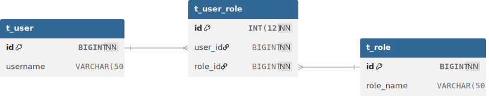

# 映射器

[[toc]]


## 1.概述

~~~xml
<mapper namespace="xxx">
    <!-- 基础配置类元素 -->
    <cache />
    <cache-ref />
    <parameterMap />

    <!-- SQL 构建元素（可复用 SQL 片段） -->
    <sql />

    <!-- CRUD 元素（核心） -->
    <select />
    <insert />
    <update />
    <delete />

    <!-- 结果映射元素 -->
    <resultMap />
    <result />
    <id />
    <association />
    <collection />
    <discriminator />
</mapper>
~~~

## 2.select

### ①.常用属性

| 属性名            | 说明                                        | 示例                      |
| ----------------- | ------------------------------------------- | ------------------------- |
| **id**            | 对应 Mapper 接口的方法名                    | id="findUserById"         |
| **parameterType** | 入参类型，可写类全路径、别名、Map、基本类型 | parameterType="int"       |
| **resultType**    | 返回类型（对象/基本类型/Map）               | resultType="com.xx.User"  |
| **resultMap**     | 使用自定义映射时使用                        | resultMap="userResultMap" |
| **flushCache**    | 是否刷新缓存（查询默认 false）              | flushCache="false"        |
| **useCache**      | 是否使用二级缓存（默认 true）               | useCache="true"           |
| **timeout**       | 超时毫秒数，少用                            | timeout="5000"            |
| **fetchSize**     | 一次拉取多少条记录                          | fetchSize="100"           |

### ②.多个参数

1. Map传参
   * 优点：几乎适应所有场景
   * 缺点：
     * 可读性差
     * 不能限定参数的类型
2. 注解传参
   * 优点：
     * 可读性好
     * 可以限定参数的类型
   * 缺点：参数较多时写起来麻烦
3. Java Bean传参
   * 优点：即使参数多，只需传一个对象
   * 缺点：复杂场景可能另外需要注解传参
4. 混合传参（注解 + Java Bean）
   * 优点：可以应对复杂场景

~~~java
package com.learn.ssm.chapter5.mapper;

import com.learn.ssm.chapter5.pojo.PageParam;
import com.learn.ssm.chapter5.pojo.Role;
import org.apache.ibatis.annotations.Param;

import java.util.List;
import java.util.Map;

public interface RoleMapper {
    public Role getRole(Long id);
    public List<Role> findRolesByMap(Map<String,Object> parameterMap);
    public List<Role> findRolesByAnnotation(@Param("roleName") String roleName, @Param("note") String note) ;
    public List<Role> findRolesByBean(Role role);
    public List<Role> findByMix(@Param("params") Role role, @Param("page") PageParam PageParam) ;
}
~~~

~~~xml
<?xml version="1.0" encoding="UTF-8" ?>
<!DOCTYPE mapper PUBLIC "-//mybatis.org//DTD Mapper 3.0//EN"
        "http://mybatis.org/dtd/mybatis-3-mapper.dtd">
<mapper namespace="com.learn.ssm.chapter5.mapper.RoleMapper">

    <select id="getRole" parameterType="long" resultType="role5">
        select id, role_name as roleName, note from t_role where id = #{id}
    </select>

    <select id="findRolesByMap" parameterType="map" resultType="role5">
        select id, role_name as roleName, note from t_role
        where role_name like concat('%', #{roleName}, '%')
        and note like concat('%', #{note}, '%')
    </select>

    <select id="findRolesByAnnotation" resultType="role5">
        select id, role_name as roleName, note from t_role
        where role_name like concat('%', #{roleName}, '%')
        and note like concat('%', #{note}, '%')
    </select>

    <select id="findRolesByBean" parameterType="com.learn.ssm.chapter5.pojo.Role" resultType="role5">
        select id, role_name as roleName, note from t_role
        where role_name like concat('%', #{roleName}, '%')
        and note like concat('%', #{note}, '%')
    </select>

    <select id="findByMix" resultType="role5">
        <bind name="offset" value="(page.pageNo - 1) * page.pageSize"/>
        select id, role_name as roleName, note from t_role
        where role_name like concat('%', #{params.roleName}, '%')
        and note like concat('%', #{params.note}, '%')
        limit #{offset}, #{page.pageSize}
    </select>

</mapper>
~~~

~~~java
package com.learn.ssm.chapter5.main;

import com.learn.ssm.chapter5.pojo.PageParam;
import com.learn.ssm.chapter5.pojo.Role;
import com.learn.ssm.chapter5.utils.SqlSessionFactoryUtils;
import com.learn.ssm.chapter5.mapper.RoleMapper;
import org.apache.ibatis.session.SqlSession;

import java.util.HashMap;
import java.util.List;

public class Main {
    public static void main(String[] args) {
        SqlSession sqlSession = null;

        try {
            sqlSession = SqlSessionFactoryUtils.openSqlSession();
            RoleMapper roleMapper = sqlSession.getMapper(RoleMapper.class);
            Role role = roleMapper.getRole(11L);
            System.out.println(role.toString());

            // 1.Map传参
            HashMap<String, Object> hashMap = new HashMap<>();
            hashMap.put("roleName", "is");
            hashMap.put("note", "st");
            List<Role> rolesByMap = roleMapper.findRolesByMap(hashMap);
            System.out.println(rolesByMap.toString());

            // 2.注解传参
            List<Role> rolesByAnnotation = roleMapper.findRolesByAnnotation("is", "st");
            System.out.println(rolesByAnnotation.toString());

            // 3.Java Bean传参
            Role role1 = new Role();
            role1.setRoleName("is");
            role1.setNote("st");
            List<Role> rolesByBean = roleMapper.findRolesByBean(role1);
            System.out.println(rolesByBean.toString());

            // 4.混合传参(注解 + Java Bean)
            PageParam pageParam = new PageParam();
            pageParam.setPageNo(1);
            pageParam.setPageSize(1);
            List<Role> byMix = roleMapper.findByMix(role1, pageParam);
            System.out.println(byMix);

            //提交事务
            sqlSession.commit();
        } catch (Exception e) {
            if(sqlSession != null) {
                sqlSession.rollback();
            }
            e.printStackTrace();
        } finally {
            if (sqlSession != null) {
                sqlSession.close();
            }
        }
    }
}
~~~

### ③resultMap

> 有了resultType，为什么还需要resultMap？

使用 `resultType` 时，MyBatis 会直接把 **column → property** 自动转换，但这只适合：

- 字段名和属性名一致
- 一张表对应一个简单实体类
- 没有关联对象

但真实业务远比这个复杂。

当出现以下情况时，就必须使用 `resultMap`：

1. 多表联查
2. 一对多映射
3. 嵌套查询
4. 多态

User.java

~~~java
package com.learn.ssm.chapter5.pojo;

public class User {
    private Long id;
    private String username;
    private String password;
    private Integer sex;
    private Dept dept;
    // ...
}
~~~

Dept.java

~~~java
package com.learn.ssm.chapter5.pojo;

public class Dept {
    private Long id;
    private String name;
    // ...
}
~~~

UserMapper.java

~~~java
package com.learn.ssm.chapter5.mapper;

import com.learn.ssm.chapter5.pojo.User;

public interface UserMapper {
    User getUser(Long id);
}
~~~

UserMapper.xml

~~~xml
<?xml version="1.0" encoding="UTF-8" ?>
<!DOCTYPE mapper PUBLIC "-//mybatis.org//DTD Mapper 3.0//EN"
        "http://mybatis.org/dtd/mybatis-3-mapper.dtd">
<mapper namespace="com.learn.ssm.chapter5.mapper.UserMapper">

    <resultMap id="userMap" type="user5">
        <id column="id" property="id"/>
        <result column="username" property="username"/>

        <association property="dept" javaType="dept">
            <id column="deptId" property="id"/>
            <result column="deptName" property="name"/>
        </association>
    </resultMap>

    <select id="getUser" parameterType="long" resultMap="userMap">
        select u.id, u.username, d.id as deptId, d.name as deptName
        from t_user u join dept d on u.deptId = d.id where u.id = #{id}
    </select>

</mapper>
~~~

Main.java

~~~java
UserMapper userMapper = sqlSession.getMapper(UserMapper.class);
User user1 = userMapper.getUser(1L);
User user2 = userMapper.getUser(2L);
System.out.println(user1.toString());//User{id=1, username='admin', password='null', sex=null, deptId=1, deptName='技术部'}
System.out.println(user2.toString());//User{id=2, username='user', password='null', sex=null, deptId=2, deptName='业务部'}
~~~

### ④.RowBounds

Mybatis自带的**逻辑分页（内存分页）**，而非**物理分页（数据库分页）**。

~~~java
public interface UserMapper {
    User getUser(Long id);
    List<User> getUserRowBounds(RowBounds rowBounds);
}
~~~

~~~xml
<select id="getUser" parameterType="long" resultMap="userMap">
    select u.id, u.username, d.id as deptId, d.name as deptName
    from t_user u join dept d on u.deptId = d.id where u.id = #{id}
</select>

<select id="getUserRowBounds" resultMap="userMap">
    select u.id, u.username, d.id as deptId, d.name as deptName
    from t_user u join dept d on u.deptId = d.id
</select>
~~~

~~~java
// RowBounds
RowBounds rowBounds = new RowBounds(1, 1);
List<User> users = userMapper.getUserRowBounds(rowBounds);
System.out.println(users.toString());
~~~


* 数据库分页：效果最佳
* 后端逻辑分页：
  * 若数据库与后端程序属于同一服务器，则从数据库取出数据后占用大量内存。
  * 若数据库与后端程序不在同一服务器，则数据库所在服务器占用大量内存，且传输大量数据，且占用后端服务器大量内存。
* 前端逻辑分页：
  * 传输大量数据，用户等待时间长，体验差。


## 3.insert

### ①.主键回填

> 什么是主键回填：MyBatis 中 `insert` 拿到数据库自动生成的主键（自增 id）

应用场景：insert 一条记录 => 拿到生成的 id => 用这个 id 插入子表 / 关联表

三种方式：

1. useGeneratedKeys
2. `<selectKey>`
3. Mapper 方法直接返回主键（原本返回影响行数）（不推荐）

~~~java
package com.learn.ssm.chapter5.mapper;

import com.learn.ssm.chapter5.pojo.Dept;

public interface DeptMapper {
    int insertDept(Dept dept);
    int insertDept2(Dept dept);
    int insertDeptBefore(Dept dept);
    int insertDeptAfter(Dept dept);
}
~~~

~~~xml
<?xml version="1.0" encoding="UTF-8" ?>
<!DOCTYPE mapper PUBLIC "-//mybatis.org//DTD Mapper 3.0//EN"
        "http://mybatis.org/dtd/mybatis-3-mapper.dtd">
<mapper namespace="com.learn.ssm.chapter5.mapper.DeptMapper">

    <insert id="insertDept" parameterType="dept">
        insert into dept(name) values(#{name})
    </insert>

    <insert id="insertDept2" parameterType="dept" useGeneratedKeys="true" keyProperty="id">
        insert into dept(name) values(#{name})
    </insert>

    <insert id="insertDeptBefore" parameterType="dept">
        <selectKey keyProperty="id" resultType="long" order="BEFORE">
            select if (max(id) = null, 1, max(id) + 3) from dept
        </selectKey>
        insert into dept(id, name) values(#{id}, #{name})
    </insert>

    <insert id="insertDeptAfter" parameterType="dept">
        insert into dept(name) values(#{name})
        <selectKey keyProperty="id" resultType="long" order="AFTER">
            select last_insert_id()
        </selectKey>
    </insert>

</mapper>
~~~

~~~java
// insert
DeptMapper deptMapper = sqlSession.getMapper(DeptMapper.class);
Dept dept = new Dept();
dept.setName("销售部");
deptMapper.insertDept(dept);
System.out.println(dept.toString());//Dept{id=null, name='销售部'}

Dept dept1 = new Dept();
dept1.setName("运维部");
deptMapper.insertDept2(dept1);
System.out.println(dept1.toString());//Dept{id=8, name='运维部'}

Dept deptBefore = new Dept();
deptBefore.setName("Before部");
deptMapper.insertDeptBefore(deptBefore);
System.out.println(deptBefore.toString());//Dept{id=11, name='Before部'}

Dept deptAfter = new Dept();
deptAfter.setName("After部");
deptMapper.insertDeptAfter(deptAfter);
System.out.println(deptAfter.toString());//Dept{id=12, name='After部'}
~~~

### ②自定义主键

上述例子中`insertDeptBefore`通过`selectKey`实现了自定义主键（最大id + 3）


## 4.resultType=map

> `resultType="map"` 是 MyBatis 的“**万金油返回类型**”，
>  适合“不规则结果集”，但不适合“核心业务模型”。

~~~java
List<Map<String,Object>> selectDynamicColumns(@Param("columns") String columns);
~~~

~~~xml
<select id="selectDynamicColumns" resultType="map">
    select ${columns} from t_user
</select>
~~~

~~~java
// Dynamic column + resultType=map
List<Map<String, Object>> list = userMapper.selectDynamicColumns("id,username,deptId");
System.out.println(list);
//[{deptId=1, id=1, username=admin}, {deptId=2, id=2, username=user}]
~~~

这里还用到了动态列，不过它有SQL注入风险，可通过Java层枚举白名单或xml choose白名单来避免。


## 5.sql

`<sql>` 标签用于 **定义可重用的 SQL 片段**，可以在其他 SQL 语句中通过 `<include>` 引用。

* **不单独执行**，只是“片段”
* 支持 **动态 SQL / 参数**
* 可以减少重复代码，增加可维护性


应用场景：

::: tabs 

@tab 复用列名

~~~xml
<sql id="baseColumns">
    id, username, age
</sql>

<select id="selectAll" resultType="User">
    SELECT <include refid="baseColumns"/> FROM t_user
</select>

<select id="selectById" resultType="User">
    SELECT <include refid="baseColumns"/> FROM t_user WHERE id = #{id}
</select>
~~~

@tab 复用条件

~~~xml
<sql id="userWhere">
    <where>
        <if test="username != null">
            username = #{username}
        </if>
        <if test="age != null">
            AND age = #{age}
        </if>
    </where>
</sql>

<select id="selectUser" resultType="User">
    SELECT * FROM t_user
    <include refid="userWhere"/>
</select>
~~~

@tab 复用JOIN

~~~xml
<sql id="joinDept">
    JOIN dept d ON u.dept_id = d.id
</sql>

<select id="selectUserDept" resultType="User">
    SELECT u.id, u.username, d.name AS deptName
    FROM t_user u
    <include refid="joinDept"/>
</select>
~~~

@tab 动态SQL

~~~xml
<sql id="dynamicColumns">
    <if test="includeAge">
        age,
    </if>
    username, id
</sql>

<select id="selectUserDynamic" resultType="User">
    SELECT <include refid="dynamicColumns"/> FROM t_user
</select>
~~~

:::

::: code-tabs 

@tab 复用列名

~~~xml
<sql id="baseColumns">
    id, username, age
</sql>

<select id="selectAll" resultType="User">
    SELECT <include refid="baseColumns"/> FROM t_user
</select>

<select id="selectById" resultType="User">
    SELECT <include refid="baseColumns"/> FROM t_user WHERE id = #{id}
</select>
~~~

@tab 复用条件

~~~xml
<sql id="userWhere">
    <where>
        <if test="username != null">
            username = #{username}
        </if>
        <if test="age != null">
            AND age = #{age}
        </if>
    </where>
</sql>

<select id="selectUser" resultType="User">
    SELECT * FROM t_user
    <include refid="userWhere"/>
</select>
~~~

@tab 复用JOIN

~~~xml
<sql id="joinDept">
    JOIN dept d ON u.dept_id = d.id
</sql>

<select id="selectUserDept" resultType="User">
    SELECT u.id, u.username, d.name AS deptName
    FROM t_user u
    <include refid="joinDept"/>
</select>
~~~

@tab 动态SQL

~~~xml
<sql id="dynamicColumns">
    <if test="includeAge">
        age,
    </if>
    username, id
</sql>

<select id="selectUserDynamic" resultType="User">
    SELECT <include refid="dynamicColumns"/> FROM t_user
</select>
~~~

:::


## 6.级联

### ①.示例


~~~sql
use ssm;

CREATE TABLE t_employee (
  id INT(12) NOT NULL AUTO_INCREMENT, 
  real_name VARCHAR(60) NOT NULL, 
  sex INT(2) NOT NULL COMMENT '1-男 0-女',
  birthday DATE NOT NULL,
  mobile VARCHAR(20) NOT NULL, 
  email VARCHAR(60) NOT NULL, 
  POSITION VARCHAR(20) NOT NULL, 
  note VARCHAR (256),
  PRIMARY KEY (id)
);

CREATE TABLE t_employee_task (
  id INT(12) NOT NULL, 
  emp_id INT(12) NOT NULL, 
  task_id INT(12) NOT NULL, 
  task_name VARCHAR(60) NOT NULL, 
  note VARCHAR(256), 
  PRIMARY KEY (id)
);

CREATE TABLE t_female_health_form (
  id INT(12) NOT NULL AUTO_INCREMENT, 
  emp_id INT(12) NOT NULL, 
  heart VARCHAR(64) NOT NULL, 
  liver VARCHAR(64) NOT NULL, 
  spleen VARCHAR(64) NOT NULL, 
  lung VARCHAR(64) NOT NULL, 
  kidney VARCHAR(64) NOT NULL, 
  uterus VARCHAR(64) NOT NULL, 
  note VARCHAR(256), 
  PRIMARY KEY (id)
);

CREATE TABLE t_male_health_form (
  id INT(12) NOT NULL AUTO_INCREMENT, 
  emp_id INT (12) NOT NULL, 
  heart VARCHAR (64) NOT NULL, 
  liver VARCHAR (64) NOT NULL, 
  spleen VARCHAR(64) NOT NULL, 
  lung VARCHAR(64) NOT NULL, 
  kidney VARCHAR(64) NOT NULL, 
  prostate VARCHAR(64) NOT NULL, 
  note VARCHAR(256), 
  PRIMARY KEY (id)
);

CREATE TABLE t_task (
  id INT(12) NOT NULL, 
  title VARCHAR(60) NOT NULL, 
  context VARCHAR(256) NOT NULL, 
  note VARCHAR(256), 
  PRIMARY KEY (id)
);

create table t_work_card (
  id INT (12) not null auto_increment, 
  emp_id INT (12) not null, 
  real_name VARCHAR(60) not null, 
  department VARCHAR(20) not null, 
  mobile VARCHAR(20) not null, 
  position VARCHAR(30) not null, 
  note VARCHAR(256), 
  primary key (id)
);

ALTER TABLE t_employee_task 
ADD CONSTRAINT FK_Reference_4 FOREIGN KEY(emp_id) REFERENCES t_employee(id) ON DELETE RESTRICT ON UPDATE RESTRICT;

ALTER TABLE t_employee_task 
ADD CONSTRAINT FK_Reference_8 FOREIGN KEY(task_id) REFERENCES t_task(id) ON DELETE RESTRICT ON UPDATE RESTRICT;

ALTER TABLE t_female_health_form 
ADD CONSTRAINT FK_Reference_5 FOREIGN KEY(emp_id) REFERENCES t_employee(id) ON DELETE RESTRICT ON UPDATE RESTRICT;

ALTER TABLE t_male_health_form 
ADD CONSTRAINT FK_Reference_6 FOREIGN KEY(emp_id) REFERENCES t_employee(id) ON DELETE RESTRICT ON UPDATE RESTRICT;

ALTER TABLE t_work_card 
ADD CONSTRAINT FK_Reference_7 FOREIGN KEY(emp_id) REFERENCES t_employee(id) ON DELETE RESTRICT ON UPDATE RESTRICT;


INSERT INTO t_employee (real_name, sex, birthday, mobile, email, POSITION, note)
VALUES
('张三', 1, '1990-05-12', '13800000001', 'zhangsan@test.com', '工程师', '技术骨干'),
('李四', 0, '1992-08-20', '13800000002', 'lisi@test.com', '测试工程师', '细心认真'),
('王五', 1, '1988-03-15', '13800000003', 'wangwu@test.com', '项目经理', '负责项目管理');


INSERT INTO t_task (id, title, context, note)
VALUES
(1, '系统开发', '完成核心模块开发', '优先级高'),
(2, '系统测试', '进行功能与性能测试', '需要详细记录'),
(3, '项目管理', '协调团队与进度', '定期汇报');


INSERT INTO t_employee_task (id, emp_id, task_id, task_name, note)
VALUES
(1, 1, 1, '系统开发', '负责后端模块'),
(2, 2, 2, '系统测试', '负责功能测试'),
(3, 3, 3, '项目管理', '整体项目把控');

INSERT INTO t_female_health_form
(emp_id, heart, liver, spleen, lung, kidney, uterus, note)
VALUES
(2, '正常', '正常', '正常', '正常', '正常', '正常', '体检情况良好');


INSERT INTO t_male_health_form
(emp_id, heart, liver, spleen, lung, kidney, prostate, note)
VALUES
(1, '正常', '轻度脂肪肝', '正常', '正常', '正常', '正常', '注意饮食'),
(3, '正常', '正常', '正常', '正常', '正常', '正常', '无异常');

INSERT INTO t_work_card
(emp_id, real_name, department, mobile, position, note)
VALUES
(1, '张三', '研发部', '13800000001', '工程师', '正式员工'),
(2, '李四', '测试部', '13800000002', '测试工程师', '正式员工'),
(3, '王五', '管理部', '13800000003', '项目经理', '部门负责人');
~~~


pojo / Task

~~~java
package com.learn.ssm.chapter5_cascade.pojo;

public class Task {
    private Long id;
    private String title;
    private String context;
    private String note;

    //getter and setter

    @Override
    public String toString() {
        return "Task{" +
                "id=" + id +
                ", title='" + title + '\'' +
                ", context='" + context + '\'' +
                ", note='" + note + '\'' +
                '}';
    }
}
~~~

pojo / WorkCard

~~~java
package com.learn.ssm.chapter5_cascade.pojo;

public class WorkCard {
    private Long id;
    private Long empId;
    private String realName;
    private String department;
    private String mobile;
    private String position;
    private String note;

    // getter and setter

    @Override
    public String toString() {
        return "WorkCard{" +
                "id=" + id +
                ", empId=" + empId +
                ", realName='" + realName + '\'' +
                ", department='" + department + '\'' +
                ", mobile='" + mobile + '\'' +
                ", position='" + position + '\'' +
                ", note='" + note + '\'' +
                '}';
    }
}
~~~

pojo / HealthForm

~~~java
package com.learn.ssm.chapter5_cascade.pojo;

public abstract class HealthForm {
    protected Long id;
    protected Long empId;
    protected String heart;
    protected String liver;
    protected String spleen;
    protected String lung;
    protected String kidney;
    protected String note;

    // getter and setter

    @Override
    public String toString() {
        return "HealthForm{" +
                "id=" + id +
                ", empId=" + empId +
                ", heart='" + heart + '\'' +
                ", liver='" + liver + '\'' +
                ", spleen='" + spleen + '\'' +
                ", lung='" + lung + '\'' +
                ", kidney='" + kidney + '\'' +
                ", note='" + note + '\'' +
                '}';
    }
}
~~~

pojo / MaleHealthForm

~~~java
package com.learn.ssm.chapter5_cascade.pojo;

public class MaleHealthForm extends HealthForm {
    private String prostate;

    public String getProstate() {
        return prostate;
    }

    public void setProstate(String prostate) { this.prostate = prostate; }

    @Override
    public String toString() {
        return "MaleHealthForm{" +
                "id=" + id +
                ", empId=" + empId +
                ", heart='" + heart + '\'' +
                ", liver='" + liver + '\'' +
                ", spleen='" + spleen + '\'' +
                ", lung='" + lung + '\'' +
                ", kidney='" + kidney + '\'' +
                ", prostate='" + prostate + '\'' +
                ", note='" + note + '\'' +
                '}';
    }
}
~~~

pojo / FemaleHealthForm

~~~java
package com.learn.ssm.chapter5_cascade.pojo;

public class FemaleHealthForm extends HealthForm{
    private String uterus;

    public String getUterus() {
        return uterus;
    }

    public void setUterus(String uterus) {
        this.uterus = uterus;
    }

    @Override
    public String toString() {
        return "FemaleHealthForm{" +
                "uterus='" + uterus + '\'' +
                ", id=" + id +
                ", empId=" + empId +
                ", heart='" + heart + '\'' +
                ", liver='" + liver + '\'' +
                ", spleen='" + spleen + '\'' +
                ", lung='" + lung + '\'' +
                ", kidney='" + kidney + '\'' +
                ", note='" + note + '\'' +
                '}';
    }
}
~~~

pojo / EmployeeTask

~~~java
package com.learn.ssm.chapter5_cascade.pojo;

public class EmployeeTask {
    private Long id;
    private Long empId ;
    private Task task = null;
    private String taskName ;
    private String note ;

    // getter and setter

    @Override
    public String toString() {
        return "EmployeeTask{" +
                "id=" + id +
                ", empId=" + empId +
                ", task=" + task +
                ", taskName='" + taskName + '\'' +
                ", note='" + note + '\'' +
                '}';
    }
}
~~~

pojo / Employee

~~~java
package com.learn.ssm.chapter5_cascade.pojo;

import com.learn.ssm.chapter5_cascade.enumeration.SexEnum;

import java.util.Date;
import java.util.List;

public class Employee {
    private Long id;
    private String realName;
    private SexEnum sex = null;
    private Date birthday;
    private String mobile;
    private String email;
    private String position;
    private String note;
    //工牌按一对一级联
    private WorkCard workCard;
    //雇员任务，一对多级联
    private List<EmployeeTask> employeeTaskList = null;

    private HealthForm healthForm;

    // getter and setter

    @Override
    public String toString() {
        return "Employee{" +
                "id=" + id +
                ", realName='" + realName + '\'' +
                ", sex=" + sex +
                ", birthday=" + birthday +
                ", mobile='" + mobile + '\'' +
                ", email='" + email + '\'' +
                ", position='" + position + '\'' +
                ", note='" + note + '\'' +
                ", workCard=" + workCard +
                ", employeeTaskList=" + employeeTaskList +
                ", healthForm=" + healthForm +
                '}';
    }
}
~~~

pojo / MaleEmployee

~~~java
package com.learn.ssm.chapter5_cascade.pojo;

public class MaleEmployee extends Employee {
    private MaleHealthForm maleHealthForm = null ;

    public MaleHealthForm getMaleHealthForm() {
        return maleHealthForm;
    }

    public void setMaleHealthForm(MaleHealthForm maleHealthForm) {
        this.maleHealthForm = maleHealthForm;
    }
}
~~~

pojo / FemaleEmployee

~~~java
package com.learn.ssm.chapter5_cascade.pojo;

public class FemaleEmployee extends Employee {
    private FemaleHealthForm femaleHealthForm = null;

    public FemaleHealthForm getFemaleHealthForm() {
        return femaleHealthForm;
    }

    public void setFemaleHealthForm(FemaleHealthForm femaleHealthForm) {
        this.femaleHealthForm = femaleHealthForm;
    }
}
~~~

mapper / EmployeeTaskMapper.xml

~~~xml
<?xml version="1.0" encoding="UTF-8" ?>
<!DOCTYPE mapper PUBLIC "-//mybatis.org//DTD Mapper 3.0//EN"
        "http://mybatis.org/dtd/mybatis-3-mapper.dtd">
<mapper namespace="com.learn.ssm.chapter5_cascade.mapper.EmployeeTaskMapper">

    <resultMap type="com.learn.ssm.chapter5_cascade.pojo.EmployeeTask" id="EmployeeTaskMap">
        <id column="id" property="id"/>
        <result column="emp_id" property="empId"/>
        <result column="task_name" property="taskName"/>
        <result column="note" property="note"/>
        <association property="task" column="task_id"
                     select="com.learn.ssm.chapter5_cascade.mapper.TaskMapper.getTaskById"/>
    </resultMap>

    <select id="getEmployeeTaskByEmpId" resultMap="EmployeeTaskMap">
        select id, emp_id, task_name, task_id, note from t_employee_task
        where emp_id = #{empId}
    </select>

</mapper>
~~~

**association**标签表示一对一级联，select属性表示采用哪个方法来拿到结果，column属性表示SQL中的列，同时作为参数传给select属性对应的方法（如果这里有多个参数，则需要通过逗号隔开），property属性表示将结果映射到POJO哪个属性上。


mapper / EmployeeMapper.xml

~~~xml
<?xml version="1.0" encoding="UTF-8" ?>
<!DOCTYPE mapper PUBLIC "-//mybatis.org//DTD Mapper 3.0//EN"
        "http://mybatis.org/dtd/mybatis-3-mapper.dtd">
<mapper namespace="com.learn.ssm.chapter5_cascade.mapper.EmployeeMapper">

    <resultMap type="com.learn.ssm.chapter5_cascade.pojo.Employee" id="employee">
        <id column="id" property="id"/>
        <result column="real_name" property="realName"/>
        <result column="sex" property="sex" typeHandler="com.learn.ssm.chapter5_cascade.typeHandler.SexEnumTypeHandler"/>
        <result column="birthday" property="birthday"/>
        <result column="mobile" property="mobile"/>
        <result column="email" property="email"/>
        <result column="position" property="position"/>
        <result column="note" property="note"/>

        <association property="workCard" column="id" select="com.learn.ssm.chapter5_cascade.mapper.WorkCardMapper.getWorkCardByEmpId"/>

        <collection property="employeeTaskList" column="id" select="com.learn.ssm.chapter5_cascade.mapper.EmployeeTaskMapper.getEmployeeTaskByEmpId"/>

        <discriminator javaType="long" column="sex">
            <case value="1" resultMap="maleHealthFormMapper"/>
            <case value="0" resultMap="femaleHealthFormMapper"/>
        </discriminator>
    </resultMap>

    <resultMap type="com.learn.ssm.chapter5_cascade.pojo.FemaleEmployee" id="femaleHealthFormMapper" extends="employee">
        <association property="healthForm" column="id" select="com.learn.ssm.chapter5_cascade.mapper.FemaleHealthFormMapper.getFemaleHealthForm"/>
    </resultMap>

    <resultMap type="com.learn.ssm.chapter5_cascade.pojo.MaleEmployee" id="maleHealthFormMapper" extends="employee">
        <association property="healthForm" column="id" select="com.learn.ssm.chapter5_cascade.mapper.MaleHealthFormMapper.getMaleHealthForm"/>
    </resultMap>

    <select id="getEmployee" parameterType="long" resultMap="employee">
        select id, real_name as realName, sex, birthday, mobile, email, position, note from t_employee where id = #{id}
    </select>

</mapper>
~~~

**collection**标签表示一对多级联，select属性表示采用哪个方法来拿到结果，column属性表示SQL中的列，同时作为参数传给select属性对应的方法（如果这里有多个参数，则需要通过逗号隔开），property属性表示将结果映射到POJO哪个属性上。

**discriminator**标签表示**鉴别器**，column属性表示采用SQL中的哪一列来鉴别，而它的子元素case，则用于进行区分，类似于Java的switch...case..语句。而resultMap属性表示采用哪个ResultMap去映射，比如sex=1，则使用maleHealthFormMapper进行映射。

resultMap的extends属性的作用是：继承另一个 resultMap 的配置。 

输出：

~~~shell
DEBUG 2025-12-31 14:10:38,034 org.apache.ibatis.logging.LogFactory: Logging initialized using 'class org.apache.ibatis.logging.slf4j.Slf4jImpl' adapter.
DEBUG 2025-12-31 14:10:38,120 org.apache.ibatis.datasource.pooled.PooledDataSource: PooledDataSource forcefully closed/removed all connections.
DEBUG 2025-12-31 14:10:38,121 org.apache.ibatis.datasource.pooled.PooledDataSource: PooledDataSource forcefully closed/removed all connections.
DEBUG 2025-12-31 14:10:38,121 org.apache.ibatis.datasource.pooled.PooledDataSource: PooledDataSource forcefully closed/removed all connections.
DEBUG 2025-12-31 14:10:38,121 org.apache.ibatis.datasource.pooled.PooledDataSource: PooledDataSource forcefully closed/removed all connections.
DEBUG 2025-12-31 14:10:38,249 org.apache.ibatis.transaction.jdbc.JdbcTransaction: Opening JDBC Connection
DEBUG 2025-12-31 14:10:38,751 org.apache.ibatis.datasource.pooled.PooledDataSource: Created connection 1389509050.
DEBUG 2025-12-31 14:10:38,751 org.apache.ibatis.transaction.jdbc.JdbcTransaction: Setting autocommit to false on JDBC Connection [com.mysql.cj.jdbc.ConnectionImpl@52d239ba]
DEBUG 2025-12-31 14:10:38,752 org.apache.ibatis.logging.jdbc.BaseJdbcLogger: ==>  Preparing: select id, real_name as realName, sex, birthday, mobile, email, position, note from t_employee where id = ? 
DEBUG 2025-12-31 14:10:38,773 org.apache.ibatis.logging.jdbc.BaseJdbcLogger: ==> Parameters: 1(Long)
DEBUG 2025-12-31 14:10:38,787 org.apache.ibatis.logging.jdbc.BaseJdbcLogger: ====>  Preparing: select id, emp_id as empId, heart, liver, spleen, lung, kidney, prostate, note from t_male_health_form where emp_id = ? 
DEBUG 2025-12-31 14:10:38,787 org.apache.ibatis.logging.jdbc.BaseJdbcLogger: ====> Parameters: 1(Long)
DEBUG 2025-12-31 14:10:38,790 org.apache.ibatis.logging.jdbc.BaseJdbcLogger: <====      Total: 1
DEBUG 2025-12-31 14:10:38,792 org.apache.ibatis.logging.jdbc.BaseJdbcLogger: ====>  Preparing: SELECT id, emp_id as empId, real_name as realName, department, mobile, position, note FROM t_work_card where emp_id = ? 
DEBUG 2025-12-31 14:10:38,792 org.apache.ibatis.logging.jdbc.BaseJdbcLogger: ====> Parameters: 1(Long)
DEBUG 2025-12-31 14:10:38,794 org.apache.ibatis.logging.jdbc.BaseJdbcLogger: <====      Total: 1
DEBUG 2025-12-31 14:10:38,795 org.apache.ibatis.logging.jdbc.BaseJdbcLogger: ====>  Preparing: select id, emp_id, task_name, task_id, note from t_employee_task where emp_id = ? 
DEBUG 2025-12-31 14:10:38,795 org.apache.ibatis.logging.jdbc.BaseJdbcLogger: ====> Parameters: 1(Integer)
DEBUG 2025-12-31 14:10:38,796 org.apache.ibatis.logging.jdbc.BaseJdbcLogger: ======>  Preparing: select id, title, context, note from t_task where id = ? 
DEBUG 2025-12-31 14:10:38,796 org.apache.ibatis.logging.jdbc.BaseJdbcLogger: ======> Parameters: 1(Long)
DEBUG 2025-12-31 14:10:38,797 org.apache.ibatis.logging.jdbc.BaseJdbcLogger: <======      Total: 1
DEBUG 2025-12-31 14:10:38,797 org.apache.ibatis.logging.jdbc.BaseJdbcLogger: <====      Total: 1
DEBUG 2025-12-31 14:10:38,797 org.apache.ibatis.logging.jdbc.BaseJdbcLogger: <==      Total: 1
 INFO 2025-12-31 14:10:38,799 com.learn.ssm.chapter5_cascade.main.Main: Employee{id=1, realName='张三', sex=MALE, birthday=Sat May 12 00:00:00 CDT 1990, mobile='13800000001', email='zhangsan@test.com', position='工程师', note='技术骨干', workCard=WorkCard{id=1, empId=1, realName='张三', department='研发部', mobile='13800000001', position='工程师', note='正式员工'}, employeeTaskList=[EmployeeTask{id=1, empId=1, task=Task{id=1, title='系统开发', context='完成核心模块开发', note='优先级高'}, taskName='系统开发', note='负责后端模块'}], healthForm=MaleHealthForm{id=1, empId=1, heart='正常', liver='轻度脂肪肝', spleen='正常', lung='正常', kidney='正常', prostate='正常', note='注意饮食'}}
DEBUG 2025-12-31 14:10:38,799 org.apache.ibatis.logging.jdbc.BaseJdbcLogger: ==>  Preparing: select id, real_name as realName, sex, birthday, mobile, email, position, note from t_employee where id = ? 
DEBUG 2025-12-31 14:10:38,799 org.apache.ibatis.logging.jdbc.BaseJdbcLogger: ==> Parameters: 2(Long)
DEBUG 2025-12-31 14:10:38,800 org.apache.ibatis.logging.jdbc.BaseJdbcLogger: ====>  Preparing: select id, emp_id as empId, heart, liver, spleen, lung, kidney, uterus, note from t_female_health_form where emp_id = ? 
DEBUG 2025-12-31 14:10:38,800 org.apache.ibatis.logging.jdbc.BaseJdbcLogger: ====> Parameters: 2(Long)
DEBUG 2025-12-31 14:10:38,802 org.apache.ibatis.logging.jdbc.BaseJdbcLogger: <====      Total: 1
DEBUG 2025-12-31 14:10:38,802 org.apache.ibatis.logging.jdbc.BaseJdbcLogger: ====>  Preparing: SELECT id, emp_id as empId, real_name as realName, department, mobile, position, note FROM t_work_card where emp_id = ? 
DEBUG 2025-12-31 14:10:38,803 org.apache.ibatis.logging.jdbc.BaseJdbcLogger: ====> Parameters: 2(Long)
DEBUG 2025-12-31 14:10:38,804 org.apache.ibatis.logging.jdbc.BaseJdbcLogger: <====      Total: 1
DEBUG 2025-12-31 14:10:38,804 org.apache.ibatis.logging.jdbc.BaseJdbcLogger: ====>  Preparing: select id, emp_id, task_name, task_id, note from t_employee_task where emp_id = ? 
DEBUG 2025-12-31 14:10:38,804 org.apache.ibatis.logging.jdbc.BaseJdbcLogger: ====> Parameters: 2(Integer)
DEBUG 2025-12-31 14:10:38,805 org.apache.ibatis.logging.jdbc.BaseJdbcLogger: ======>  Preparing: select id, title, context, note from t_task where id = ? 
DEBUG 2025-12-31 14:10:38,805 org.apache.ibatis.logging.jdbc.BaseJdbcLogger: ======> Parameters: 2(Long)
DEBUG 2025-12-31 14:10:38,805 org.apache.ibatis.logging.jdbc.BaseJdbcLogger: <======      Total: 1
DEBUG 2025-12-31 14:10:38,806 org.apache.ibatis.logging.jdbc.BaseJdbcLogger: <====      Total: 1
DEBUG 2025-12-31 14:10:38,806 org.apache.ibatis.logging.jdbc.BaseJdbcLogger: <==      Total: 1
 INFO 2025-12-31 14:10:38,806 com.learn.ssm.chapter5_cascade.main.Main: Employee{id=2, realName='李四', sex=FEMALE, birthday=Thu Aug 20 00:00:00 CST 1992, mobile='13800000002', email='lisi@test.com', position='测试工程师', note='细心认真', workCard=WorkCard{id=2, empId=2, realName='李四', department='测试部', mobile='13800000002', position='测试工程师', note='正式员工'}, employeeTaskList=[EmployeeTask{id=2, empId=2, task=Task{id=2, title='系统测试', context='进行功能与性能测试', note='需要详细记录'}, taskName='系统测试', note='负责功能测试'}], healthForm=FemaleHealthForm{uterus='正常', id=1, empId=2, heart='正常', liver='正常', spleen='正常', lung='正常', kidney='正常', note='体检情况良好'}}
DEBUG 2025-12-31 14:10:38,806 org.apache.ibatis.logging.jdbc.BaseJdbcLogger: ==>  Preparing: select id, real_name as realName, sex, birthday, mobile, email, position, note from t_employee where id = ? 
DEBUG 2025-12-31 14:10:38,806 org.apache.ibatis.logging.jdbc.BaseJdbcLogger: ==> Parameters: 3(Long)
DEBUG 2025-12-31 14:10:38,807 org.apache.ibatis.logging.jdbc.BaseJdbcLogger: ====>  Preparing: select id, emp_id as empId, heart, liver, spleen, lung, kidney, prostate, note from t_male_health_form where emp_id = ? 
DEBUG 2025-12-31 14:10:38,807 org.apache.ibatis.logging.jdbc.BaseJdbcLogger: ====> Parameters: 3(Long)
DEBUG 2025-12-31 14:10:38,808 org.apache.ibatis.logging.jdbc.BaseJdbcLogger: <====      Total: 1
DEBUG 2025-12-31 14:10:38,808 org.apache.ibatis.logging.jdbc.BaseJdbcLogger: ====>  Preparing: SELECT id, emp_id as empId, real_name as realName, department, mobile, position, note FROM t_work_card where emp_id = ? 
DEBUG 2025-12-31 14:10:38,808 org.apache.ibatis.logging.jdbc.BaseJdbcLogger: ====> Parameters: 3(Long)
DEBUG 2025-12-31 14:10:38,809 org.apache.ibatis.logging.jdbc.BaseJdbcLogger: <====      Total: 1
DEBUG 2025-12-31 14:10:38,809 org.apache.ibatis.logging.jdbc.BaseJdbcLogger: ====>  Preparing: select id, emp_id, task_name, task_id, note from t_employee_task where emp_id = ? 
DEBUG 2025-12-31 14:10:38,809 org.apache.ibatis.logging.jdbc.BaseJdbcLogger: ====> Parameters: 3(Integer)
DEBUG 2025-12-31 14:10:38,810 org.apache.ibatis.logging.jdbc.BaseJdbcLogger: ======>  Preparing: select id, title, context, note from t_task where id = ? 
DEBUG 2025-12-31 14:10:38,810 org.apache.ibatis.logging.jdbc.BaseJdbcLogger: ======> Parameters: 3(Long)
DEBUG 2025-12-31 14:10:38,811 org.apache.ibatis.logging.jdbc.BaseJdbcLogger: <======      Total: 1
DEBUG 2025-12-31 14:10:38,811 org.apache.ibatis.logging.jdbc.BaseJdbcLogger: <====      Total: 1
DEBUG 2025-12-31 14:10:38,811 org.apache.ibatis.logging.jdbc.BaseJdbcLogger: <==      Total: 1
 INFO 2025-12-31 14:10:38,811 com.learn.ssm.chapter5_cascade.main.Main: Employee{id=3, realName='王五', sex=MALE, birthday=Tue Mar 15 00:00:00 CST 1988, mobile='13800000003', email='wangwu@test.com', position='项目经理', note='负责项目管理', workCard=WorkCard{id=3, empId=3, realName='王五', department='管理部', mobile='13800000003', position='项目经理', note='部门负责人'}, employeeTaskList=[EmployeeTask{id=3, empId=3, task=Task{id=3, title='项目管理', context='协调团队与进度', note='定期汇报'}, taskName='项目管理', note='整体项目把控'}], healthForm=MaleHealthForm{id=2, empId=3, heart='正常', liver='正常', spleen='正常', lung='正常', kidney='正常', prostate='正常', note='无异常'}}
DEBUG 2025-12-31 14:10:38,811 org.apache.ibatis.transaction.jdbc.JdbcTransaction: Resetting autocommit to true on JDBC Connection [com.mysql.cj.jdbc.ConnectionImpl@52d239ba]
DEBUG 2025-12-31 14:10:38,811 org.apache.ibatis.transaction.jdbc.JdbcTransaction: Closing JDBC Connection [com.mysql.cj.jdbc.ConnectionImpl@52d239ba]
DEBUG 2025-12-31 14:10:38,811 org.apache.ibatis.datasource.pooled.PooledDataSource: Returned connection 1389509050 to pool.

Process finished with exit code 0
~~~

**查询时流程：**

1. 执行 `getEmployee` 查询，使用基础的 `employee` resultMap
2. 根据 `sex` 字段的值（鉴别器 column）决定使用哪个**子 resultMap**
3. 如果是女性（sex=0），使用 `femaleHealthFormMapper`
   - 继承所有 `employee` 的基础映射
   - 额外添加 `healthForm` 关联（女性健康表）
4. 如果是男性（sex=1），使用 `maleHealthFormMapper`
   - 继承所有 `employee` 的基础映射
   - 额外添加 `healthForm` 关联（男性健康表）

**用代码模拟这个过程：**

~~~java
// 模拟 MyBatis 的内部处理逻辑
public Employee processResultSet(ResultSet rs) {
    // 1. 创建基础对象（根据type="Employee"）
    Employee emp = new Employee();
    
    // 2. 应用employee resultMap的所有基础映射
    emp.setId(rs.getLong("id"));
    emp.setRealName(rs.getString("real_name"));
    emp.setSex(sexTypeHandler.getResult(rs, "sex"));  // 使用TypeHandler转换
    // ... 映射其他基础字段
    
    // 3. 应用关联映射（workCard等）
    emp.setWorkCard(workCardMapper.getWorkCard(emp.getId()));
    
    // 4. 鉴别器判断
    long sexValue = rs.getLong("sex");
    if (sexValue == 1) {
        // 5. 转换为子类
        MaleEmployee maleEmp = new MaleEmployee();
        BeanUtils.copyProperties(emp, maleEmp);  // 复制所有已映射的属性
        
        // 6. 应用maleHealthFormMapper的额外配置
        maleEmp.setHealthForm(maleHealthFormMapper.getMaleHealthForm(maleEmp.getId()));
        
        return maleEmp;
    } else if (sexValue == 0) {
        // 同理，处理女性员工
        FemaleEmployee femaleEmp = new FemaleEmployee();
        BeanUtils.copyProperties(emp, femaleEmp);
        femaleEmp.setHealthForm(femaleHealthFormMapper.getFemaleHealthForm(femaleEmp.getId()));
        return femaleEmp;
    }
    
    return emp;  // 如果没有匹配的case，返回基础Employee
}
~~~

**查询开始时使用第一个resultMap（employee），但在处理过程中会根据sex值动态应用后两个resultMap之一，并且后两个resultMap继承了第一个的所有配置，同时添加了特有的健康表关联。**

这是一个**继承 + 多态**的设计模式，不是简单的"切换替换"。


### ②.DTO

级联是一种设计理念，实际工程开发中，若采用级联，则**SQL混乱、性能堪忧、N+1冗余**，所以企业级开发常用**DTO（数据传输对象）**来代替级联。

> DTO 方案 = 可控 SQL + 可预测性能 + 更贴近真实业务（灵活多变）
>
> DTO的思路是：接口要什么数据，就一次性查出来， 用一个 DTO 装好返回。

员工详情 DTO（示例）

```java
public class EmployeeDetailDTO {

    // ===== 员工基本信息 =====
    private Long empId;
    private String realName;
    private Integer sex;
    private Date birthday;
    private String mobile;
    private String email;
    private String position;

    // ===== 工作证 =====
    private String department;

    // ===== 体检信息（统一结构）=====
    private String heart;
    private String liver;
    private String spleen;
    private String lung;
    private String kidney;
    private String special;   // 男：prostate / 女：uterus
    private String healthNote;

    // ===== 任务 =====
    private List<TaskDTO> tasks;
}
```

子 DTO（任务）

```java
public class TaskDTO {
    private Long taskId;
    private String taskName;
    private String context;
}
```

 **DTO 是“为接口量身定制的结构”**。

Mapper：**多次 SQL + 手动组装**

EmployeeMapper.xml

```xml
<select id="getEmployeeBase"
        resultType="com.learn.ssm.chapter5_cascade.dto.EmployeeDetailDTO">
    SELECT
        e.id        AS empId,
        e.real_name AS realName,
        e.sex,
        e.birthday,
        e.mobile,
        e.email,
        e.position,
        wc.department
    FROM t_employee e
    LEFT JOIN t_work_card wc ON wc.emp_id = e.id
    WHERE e.id = #{id}
</select>
```

HealthMapper.xml（统一）

```xml
<select id="getMaleHealth"
        resultType="map">
    SELECT heart, liver, spleen, lung, kidney, prostate AS special, note AS healthNote
    FROM t_male_health_form
    WHERE emp_id = #{id}
</select>

<select id="getFemaleHealth"
        resultType="map">
    SELECT heart, liver, spleen, lung, kidney, uterus AS special, note AS healthNote
    FROM t_female_health_form
    WHERE emp_id = #{id}
</select>
```

TaskMapper.xml

```xml
<select id="getTasksByEmpId"
        resultType="com.learn.ssm.chapter5_cascade.dto.TaskDTO">
    SELECT
        t.id        AS taskId,
        et.task_name AS taskName,
        t.context
    FROM t_employee_task et
    JOIN t_task t ON t.id = et.task_id
    WHERE et.emp_id = #{empId}
</select>
```

Service 层（真正的“组装者”）

```java
EmployeeDetailDTO dto = employeeMapper.getEmployeeBase(id);

if (dto.getSex() == 1) {
    Map<String, Object> health = healthMapper.getMaleHealth(id);
    BeanUtils.copyProperties(health, dto);
} else {
    Map<String, Object> health = healthMapper.getFemaleHealth(id);
    BeanUtils.copyProperties(health, dto);
}

List<TaskDTO> tasks = taskMapper.getTasksByEmpId(id);
dto.setTasks(tasks);
```

DTO 的作用是：

- 不暴露表结构
- 不被实体关系绑架
- 前端想要什么就给什么


### ③.N+1问题

这是 **ORM / MyBatis / JPA / Hibernate** 里一个**必须理解、而且非常常见的性能问题**。

> **N+1 问题 = 查 1 次主表 + 查 N 次子表
>  本来 1 次能解决的事，却执行了 N+1 次 SQL**

比如查询所有员工（employee）及其各自的任务（task）：

1. SELECT * FROM t_employee;假设查出了 **N 个员工**。
2. 后续N条SQL：
   SELECT * FROM t_employee_task WHERE emp_id = 1;
   SELECT * FROM t_employee_task WHERE emp_id = 2;
   SELECT * FROM t_employee_task WHERE emp_id = 3;
   ...

总共执行了1 + N条SQL，被称为N + 1问题。


上述过程的伪代码：

~~~xml
<select id="getEmployeeList" resultMap="employeeMap">
    SELECT id, real_name, sex FROM t_employee
</select>

<resultMap id="employeeMap" type="Employee">
    <id property="id" column="id"/>

    <collection property="taskList"
                column="id"
                select="getTaskByEmpId"/>
</resultMap>
~~~

1️⃣ 查员工（1 条）
2️⃣ 遍历员工
3️⃣ 每个员工触发 getTaskByEmpId（N 条）


如何避免N+1问题：

方案一：**JOIN + collection result** 代替 **collection select**

~~~xml
<select id="getEmployeeList" resultMap="employeeMap">
    SELECT e.id, e.real_name, t.id AS task_id, t.task_name
    FROM t_employee e
    LEFT JOIN t_employee_task t ON e.id = t.emp_id;
</select>

<resultMap id="employeeMap" type="Employee">
    <id property="id" column="id"/>

    <collection property="taskList" ofType="Task">
        <id property="id" column="task_id"/>
        <result property="taskName" column="task_name"/>
    </collection>
</resultMap>
~~~

方案二：IN查询

~~~sql
SELECT * FROM t_employee;
SELECT * FROM t_employee_task WHERE emp_id IN (1,2,3,...);
~~~


| 组合                | 风险         |
| ------------------- | ------------ |
| collection + select | N+1          |
| association + list  | N+1          |
| lazy + for 循环     | N+1          |
| toString / JSON     | **瞬间 N+1** |


虽然有**延迟加载**这种设计，但是它并不能解决N+1问题。


### ④.延迟加载（懒加载）

~~~xml
<settings>
    <setting name="lazyLoadingEnabled" value="true"/>
    <setting name="aggressiveLazyLoading" value="false"/>
</settings>
~~~

~~~java
Employee employee = employeeMapper.getEmployee(1L);// 返回 MaleEmployee 对象
logger.info(employee instanceof MaleEmployee);//true
logger.info(employee.toString());
~~~

lazyLoadingEnabled如果没有置为true，那么执行employeeMapper.getEmployee(1L)时SQL就查询了Employee + Task + WorkCard + HealthForm。

lazyLoadingEnabled置为true后，执行employeeMapper.getEmployee(1L)时SQL只查询了Employee + HealthForm（discriminator），而association以及collection对应SQL没有被调用，我在employee.toString()中访问了employeeTaskList跟workCard，所以这里才去执行对应的select SQL。

~~~shell
EBUG 2026-01-04 15:00:31,520 org.apache.ibatis.logging.jdbc.BaseJdbcLogger: ==>  Preparing: select id, real_name as realName, sex, birthday, mobile, email, position, note from t_employee where id = ? 
DEBUG 2026-01-04 15:00:31,543 org.apache.ibatis.logging.jdbc.BaseJdbcLogger: ==> Parameters: 1(Long)
DEBUG 2026-01-04 15:00:31,574 org.apache.ibatis.logging.jdbc.BaseJdbcLogger: ====>  Preparing: select id, emp_id as empId, heart, liver, spleen, lung, kidney, prostate, note from t_male_health_form where emp_id = ? 
DEBUG 2026-01-04 15:00:31,575 org.apache.ibatis.logging.jdbc.BaseJdbcLogger: ====> Parameters: 1(Long)
DEBUG 2026-01-04 15:00:31,576 org.apache.ibatis.logging.jdbc.BaseJdbcLogger: <====      Total: 1
DEBUG 2026-01-04 15:00:31,578 org.apache.ibatis.logging.jdbc.BaseJdbcLogger: <==      Total: 1
 INFO 2026-01-04 15:00:31,579 com.learn.ssm.chapter5_cascade.main.Main: true
DEBUG 2026-01-04 15:00:31,579 org.apache.ibatis.logging.jdbc.BaseJdbcLogger: ==>  Preparing: SELECT id, emp_id as empId, real_name as realName, department, mobile, position, note FROM t_work_card where emp_id = ? 
DEBUG 2026-01-04 15:00:31,580 org.apache.ibatis.logging.jdbc.BaseJdbcLogger: ==> Parameters: 1(Long)
DEBUG 2026-01-04 15:00:31,581 org.apache.ibatis.logging.jdbc.BaseJdbcLogger: <==      Total: 1
DEBUG 2026-01-04 15:00:31,583 org.apache.ibatis.logging.jdbc.BaseJdbcLogger: ==>  Preparing: select id, emp_id, task_name, task_id, note from t_employee_task where emp_id = ? 
DEBUG 2026-01-04 15:00:31,583 org.apache.ibatis.logging.jdbc.BaseJdbcLogger: ==> Parameters: 1(Integer)
DEBUG 2026-01-04 15:00:31,585 org.apache.ibatis.logging.jdbc.BaseJdbcLogger: <==      Total: 1
DEBUG 2026-01-04 15:00:31,587 org.apache.ibatis.logging.jdbc.BaseJdbcLogger: ==>  Preparing: select id, title, context, note from t_task where id = ? 
DEBUG 2026-01-04 15:00:31,587 org.apache.ibatis.logging.jdbc.BaseJdbcLogger: ==> Parameters: 1(Long)
DEBUG 2026-01-04 15:00:31,589 org.apache.ibatis.logging.jdbc.BaseJdbcLogger: <==      Total: 1
 INFO 2026-01-04 15:00:31,589 com.learn.ssm.chapter5_cascade.main.Main: Employee{id=1, realName='张三', sex=MALE, birthday=Sat May 12 00:00:00 CDT 1990, mobile='13800000001', email='zhangsan@test.com', position='工程师', note='技术骨干', workCard=WorkCard{id=1, empId=1, realName='张三', department='研发部', mobile='13800000001', position='工程师', note='正式员工'}, employeeTaskList=[EmployeeTask{id=1, empId=1, task=Task{id=1, title='系统开发', context='完成核心模块开发', note='优先级高'}, taskName='系统开发', note='负责后端模块'}], healthForm=MaleHealthForm{id=1, empId=1, heart='正常', liver='轻度脂肪肝', spleen='正常', lung='正常', kidney='正常', prostate='正常', note='注意饮食'}}
~~~

这里日志中可以看出logger.info(employee instanceof MaleEmployee);//true之前查了Employee + HealthForm，之后查了Task + WorkCard。


而**aggressive**LazyLoading（**激进式**懒加载），被设为true时，表示“一旦访问到懒加载属性中的某一个，则加载所有懒加载属性”，被置为false时，表示“哪个懒加载属性被访问了才去加载它”。


lazyLoadingEnabled的含义是：

| 选项    | 作用                              |
| ------- | --------------------------------- |
| `true`  | 允许使用延迟加载                  |
| `false` | association / collection 立刻加载 |

它只是“开关”，不决定加载策略

aggressiveLazyLoading 是“策略开关”

| 值                     | 行为                                            |
| ---------------------- | ----------------------------------------------- |
| `true`（默认，老版本） | **只要访问任意一个懒属性 → 全部懒属性一起加载** |
| `false`（推荐）        | **访问哪个属性 → 只加载哪个**                   |


### ⑤.JOIN实现级联

~~~xml
<resultMap id="employee2" type="com.learn.ssm.chapter5_cascade.pojo.Employee">
    <id column="id" property="id"/>
    <result column="real_name" property="realName"/>
    <result column="sex" property="sex" typeHandler="com.learn.ssm.chapter5_cascade.typeHandler.SexEnumTypeHandler"/>
    <result column="birthday" property="birthday"/>
    <result column="mobile" property="mobile"/>
    <result column="email" property="email"/>
    <result column="position" property="position"/>
    <result column="note" property="note"/>
    <association property="workCard" javaType="com.learn.ssm.chapter5_cascade.pojo.WorkCard" column="id">
        <id column="wc_id" property="id"/>
        <result column="id" property="empId"/>
        <result column="wc_real_name" property="realName"/>
        <result column="wc_department" property="department"/>
        <result column="wc_mobile" property="mobile"/>
        <result column="wc_position" property="position"/>
        <result column="wc_note" property="note"/>
    </association>
    <collection property="employeeTaskList" ofType="com.learn.ssm.chapter5_cascade.pojo.EmployeeTask" column="id">
        <id column="et_id" property="id"/>
        <result column="id" property="empId"/>
        <result column="et_task_name" property="taskName"/>
        <result column="et_note" property="note"/>
        <association property="task" javaType="com.learn.ssm.chapter5_cascade.pojo.Task" column="et_task_id">
            <id column="t_id" property="id"/>
            <result column="t_title" property="title"/>
            <result column="t_context" property="context"/>
            <result column="t_note" property="note"/>
        </association>
    </collection>
    <discriminator javaType="int" column="sex">
        <case value="1" resultMap="maleHealthFormMapper2"/>
        <case value="0" resultMap="femaleHealthFormMapper2"/>
    </discriminator>
</resultMap>

<resultMap type="com.learn.ssm.chapter5_cascade.pojo.MaleEmployee" id="maleHealthFormMapper2" extends="employee2">
    <association property="healthForm" column="id" javaType="com.learn.ssm.chapter5_cascade.pojo.MaleHealthForm">
        <id column="h_id" property="id"/>
        <result column="h_emp_id" property="empId"/>
        <result column="h_heart" property="heart"/>
        <result column="h_liver" property="liver"/>
        <result column="h_spleen" property="spleen"/>
        <result column="h_lung" property="lung"/>
        <result column="h_kidney" property="kidney"/>
        <result column="h_prostate" property="prostate"/>
        <result column="h_note" property="note"/>
    </association>
</resultMap>

<resultMap type="com.learn.ssm.chapter5_cascade.pojo.FemaleEmployee" id="femaleHealthFormMapper2" extends="employee2">
    <association property="healthForm" column="id" javaType="com.learn.ssm.chapter5_cascade.pojo.FemaleHealthForm">
        <id column="h_id" property="id"/>
        <result column="h_emp_id" property="empId"/>
        <result column="h_heart" property="heart"/>
        <result column="h_liver" property="liver"/>
        <result column="h_spleen" property="spleen"/>
        <result column="h_lung" property="lung"/>
        <result column="h_kidney" property="kidney"/>
        <result column="h_uterus" property="uterus"/>
        <result column="h_note" property="note"/>
    </association>
</resultMap>

<select id="getEmployee2" parameterType="long" resultMap="employee2">
    select emp.id, emp.real_name, emp.sex, emp.birthday, emp.mobile, emp.email, emp.position, emp.note,
           et.id as et_id, et.task_id as et_task_id, et.task_name as et_task_name, et.note as et_note,
            if (emp.sex = 1, mhf.id, fhf.id) as h_id,
            if (emp.sex = 1, mhf.emp_id, fhf.emp_id) as h_emp_id,
            if (emp.sex = 1, mhf.heart, fhf.heart) as h_heart,
            if (emp.sex = 1, mhf.liver, fhf.liver) as h_liver,
            if (emp.sex = 1, mhf.spleen, fhf.spleen) as h_spleen,
            if (emp.sex = 1, mhf.lung, fhf.lung) as h_lung,
            if (emp.sex = 1, mhf.kidney, fhf.kidney) as h_kidney,
            if (emp.sex = 1, mhf.note, fhf.note) as h_note,
            mhf.prostate as h_prostate, fhf.uterus as h_uterus,
            wc.id as wc_id, wc.real_name as wc_real_name, wc.department as wc_department,
            wc.mobile as wc_mobile, wc.position as wc_position, wc.note as wc_note,
            t.id as t_id, t.title as t_title, t.context as t_context, t.note as t_note
    from t_employee emp
    left join t_employee_task et on emp.id = et.emp_id
    left join t_female_health_form fhf on emp.id = fhf.emp_id
    left join t_male_health_form mhf on emp.id = mhf.emp_id
    left join t_work_card wc on emp.id = wc.emp_id
    left join t_task t on et.task_id = t.id
    where emp.id = #{id}
</select>
~~~

这能解决N+1问题，但是SQL复杂不利用维护，且一次性取出全部数据（无论是否需要）占用大量内存。

这种级联适应于关联较少的场景。

### ⑥.多对多级联



一个用户可以有多个角色（后端开发工程师、架构师、副部长），一个角色（后端开发工程师）可以分配给多个用户，所以用户跟角色是多对多的级联。

由于多对多级联很复杂，所以通常将其拆分成两个一对多的级联。

~~~java
public class User {
    private Long id;
    private String username;
    private List<Role> roleList;

    // getter, setter and toString
}
~~~

~~~java
public class Role {
    private Long id;
    private String roleName;
    private List<User> userList;
    
    // getter, setter and toString
}
~~~

~~~xml
<?xml version="1.0" encoding="UTF-8" ?>
<!DOCTYPE mapper PUBLIC "-//mybatis.org//DTD Mapper 3.0//EN"
        "http://mybatis.org/dtd/mybatis-3-mapper.dtd">
<mapper namespace="com.learn.ssm.chapter5_user_role.mapper.UserMapper">

    <resultMap type="com.learn.ssm.chapter5_user_role.pojo.User" id="userMapper">
        <id column="id" property="id"/>
        <result column="user_name" property="userName"/>
        <collection property="roleList" column="id" fetchType="lazy"
                    select="com.learn.ssm.chapter5_user_role.mapper.RoleMapper.findRolesByUserId"/>
    </resultMap>

    <select id="getUser" parameterType="long" resultMap="userMapper">
        select id, username from t_user where id = #{id}
    </select>

    <select id="findUsersByRoleId" parameterType="long" resultMap="userMapper">
        select u.id, u.username from t_user u, t_user_role ur
        where u.id = ur.user_id and ur.role_id = #{roleId}
    </select>

</mapper>
~~~

~~~xml
<?xml version="1.0" encoding="UTF-8" ?>
<!DOCTYPE mapper PUBLIC "-//mybatis.org//DTD Mapper 3.0//EN"
        "http://mybatis.org/dtd/mybatis-3-mapper.dtd">
<mapper namespace="com.learn.ssm.chapter5_user_role.mapper.RoleMapper">

    <resultMap type="com.learn.ssm.chapter5_user_role.pojo.Role" id="roleMapper">
        <id column="id" property="id"/>
        <result column="role_name" property="roleName"/>
        <collection property="userList" column="id" fetchType="lazy"
                    select="com.learn.ssm.chapter5_user_role.mapper.UserMapper.findUsersByRoleId"/>
    </resultMap>

    <select id="getRole" parameterType="long" resultMap="roleMapper">
        select id, role_name from t_role where id = #{id}
    </select>

    <select id="findRolesByUserId" parameterType="long" resultMap="roleMapper">
        select r.id, r.role_name from t_role r, t_user_role ur
        where r.id = ur.role_id and ur.user_id = #{userId}
    </select>

</mapper>
~~~

~~~java
public class Main {
    public static void main(String[] args) {
        SqlSession sqlSession = null;

        try {
            Logger logger = Logger.getLogger(Main.class);
            sqlSession = SqlSessionFactoryUtils.openSqlSession();
            RoleMapper roleMapper = sqlSession.getMapper(RoleMapper.class);
            Role role = roleMapper.getRole(1L);
//            logger.info(role.toString());函数无限互相调用，造成栈溢出(StackOverflow)
            List<User> userList = role.getUserList();
//            logger.info(userList);//函数无限互相调用，造成栈溢出(StackOverflow)

            //提交事务
            sqlSession.commit();
        } catch (Exception e) {
            if(sqlSession != null) {
                sqlSession.rollback();
            }
            e.printStackTrace();
        } finally {
            if (sqlSession != null) {
                sqlSession.close();
            }
        }
    }
}
~~~

不过值得注意的是，如果不开启懒加载，会导致函数无限互相调用，造成**栈溢出**(StackOverflow)。


## 7.缓存

MyBatis 提供了 **两级缓存**：

| 级别                     | 作用范围        | 默认   | 是否可关闭        |
| ------------------------ | --------------- | ------ | ----------------- |
| 一级缓存（Local Cache）  | `SqlSession`    | ✅ 开启 | ❌（只能调整范围） |
| 二级缓存（Mapper Cache） | Mapper 命名空间 | ❌ 关闭 | ✅                 |


### ①.一级缓存

- **默认开启**
- 生命周期 = `SqlSession`
- 同一个 `SqlSession` 内，相同 SQL + 相同参数 → 只查一次 DB

~~~java
SqlSession session = sqlSessionFactory.openSession();

User u1 = mapper.getById(1);
User u2 = mapper.getById(1);//第二次直接走缓存，不发 SQL

System.out.println(u1 == u2); // true
~~~

#### 缓存的key

MyBatis 内部使用：

```
MappedStatement + SQL + 参数 + RowBounds + 环境
```

所以：

- SQL 文本变了 ❌
- 参数变了 ❌
- RowBounds 不同 ❌

都会导致缓存失效。

#### 缓存失效

**以下操作会清空一级缓存：**

1. `session.commit()`
2. `session.rollback()`
3. `session.close()`
4. 执行 **insert / update / delete**
5. 手动清空：`session.clearCache();`

#### 实际项目

在 **Spring + MyBatis** 中：

```java
@Transactional
public void test() {
    mapper.getById(1);
    mapper.getById(1); // 仍然走一级缓存
}
```

因为 Spring 的事务绑定了同一个 `SqlSession`


### ②.二级缓存

- **跨 SqlSession**
- 作用范围：**Mapper 命名空间**
- 默认关闭，需要显式开启

#### 如何开启

① 全局开启（mybatis-config.xml）

```xml
<settings>
    <setting name="cacheEnabled" value="true"/>
</settings>
```


② Mapper 中开启

```xml
<mapper namespace="com.xxx.UserMapper">
    <cache/>
</mapper>
```

两步缺一不可。

#### 使用示例

~~~java
User u1 = mapper1.getById(1);
session1.close();

User u2 = mapper2.getById(1); // 走二级缓存
~~~

#### 前提条件

- 实现：`org.apache.ibatis.cache.Cache`
- 默认实现：`PerpetualCache + LRU`
- **数据是序列化存储的**

**返回对象必须实现 `Serializable`**

#### 缓存失效

**任意一次写操作都会清空该 Mapper 的缓存：**

```
insert / update / delete
```

甚至：

```
update t_user set name = 'x'
```

会清空 **整个 UserMapper 的二级缓存**。

#### 精细控制

~~~xml
<select id="getById" useCache="true"/>
<update id="updateUser" flushCache="true"/>
~~~

| 属性         | 作用             |
| ------------ | ---------------- |
| `useCache`   | 是否使用二级缓存 |
| `flushCache` | 是否清空缓存     |

### ③.最佳实践

一级缓存 **默认使用，不操心**
二级缓存 **慎用**，只适合：

- 读多写少
- 数据稳定
- 单表 Mapper

而核心业务，采用Redis / Caffeine 等业务缓存更可靠

> 一级缓存是“会话级别的免费性能优化”，
>
> 二级缓存是“Mapper 级别的可选能力，但风险较高”。


## 8.存储过程

**存储过程**：预先编译、存放在数据库中的一段 SQL 逻辑，可以接收参数、返回结果集或输出参数。

MyBatis 调用存储过程时，必须注意三件事：

1. **statementType="CALLABLE"**
2. **参数必须显式声明 mode（IN / OUT / INOUT）**
3. **返回结果要么是 resultType / resultMap，要么是 OUT 参数**

### ①.IN参数

~~~sql
CREATE PROCEDURE delete_user(IN uid BIGINT)
BEGIN
    DELETE FROM t_user WHERE id = uid;
END;
~~~

~~~java
void deleteUser(Long id);
~~~

~~~xml
<delete id="deleteUser" statementType="CALLABLE">
    { call delete_user( #{id} ) }
</delete>
~~~

~~~java
userMapper.deleteUser(2L);
~~~

### ②.OUT参数

~~~sql
CREATE PROCEDURE get_user_count(OUT total INT)
BEGIN
    SELECT COUNT(*) INTO total FROM t_user;
END;
~~~

~~~java
void getUserCount(Map<String, Object> params);
~~~

~~~xml
<select id="getUserCount" statementType="CALLABLE">
    { call get_user_count( #{total, mode=OUT, jdbcType=INTEGER} ) }
</select>
~~~

~~~java
Map<String, Object> map = new HashMap<>();
userMapper.getUserCount(map);
Integer userCount = (Integer) map.get("total");
logger.info(userCount);//1
~~~

### ③.IN+OUT参数组合

~~~sql
CREATE PROCEDURE count_user_by_sex(
    IN p_sex INT,
    OUT total INT
)
BEGIN
    SELECT COUNT(*) INTO total
    FROM t_user
    WHERE sex = p_sex;
END;
~~~

~~~java
void countUserBySex(Map<String, Object> params);
~~~

~~~xml
<select id="countUserBySex" statementType="CALLABLE">
    { call count_user_by_sex(
        #{p_sex, mode=IN, jdbcType=INTEGER},
        #{total, mode=OUT,jdbcType=INTEGER}
        ) }
</select>
~~~

~~~java
Map<String, Object> map2 = new HashMap<>();
map2.put("p_sex", 1);
userMapper.countUserBySex(map2);
Integer total = (Integer) map2.get("total");
logger.info(total);//1
~~~

### ④.返回结果集

~~~sql
CREATE PROCEDURE list_users()
BEGIN
    SELECT id, username, sex FROM t_user;
END;
~~~

~~~java
List<User> listUsers();
~~~

~~~xml
<select id="listUsers" statementType="CALLABLE" resultType="com.learn.ssm.chapter5_sp.pojo.User">
    { call list_users() }
</select>
~~~

~~~java
List<User> users = userMapper.listUsers();
logger.info(users);//[User{id=1, username='Max}]
~~~


存储过程注意事项：

1. statementType="CALLABLE"
2. out参数要写jdbcType：`#{total, mode=OUT, jdbcType=INTEGER}`
3. ...

> MyBatis 调用存储过程的本质是 JDBC CallableStatement，
> 用得好是性能工具，用不好是维护噩梦。
